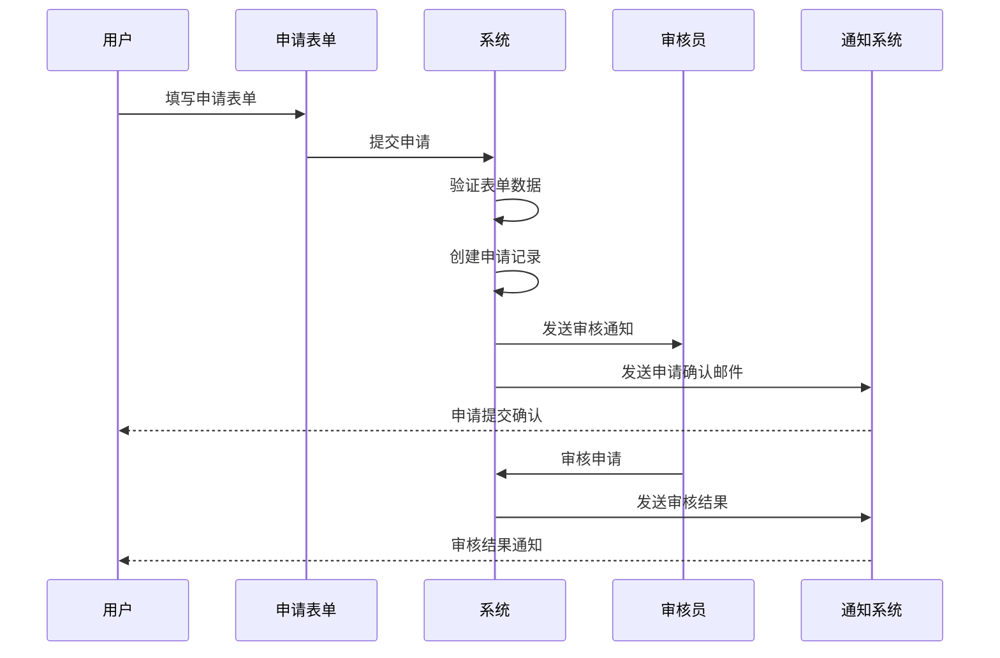

# DPCC 申请管理系统

## 📋 文档信息

- **项目名称**: DPCC - 申请管理系统
- **版本**: v1.0
- **创建日期**: 2025年10月21日
- **最后更新**: 2025年10月21日
- **文档类型**: 功能设计文档

## 🎯 申请管理概述

### 1.1 设计目标

DPCC的申请管理系统旨在控制用户对项目的访问权限，确保只有经过审核的合格用户才能参与项目贡献。系统采用两层审核机制：
1. **贡献者申请**: 用户申请成为项目贡献者
2. **内容审核**: 贡献者提交的内容需要审核才能合并

### 1.2 核心原则

- **透明性**: 所有申请和审核过程公开透明
- **公平性**: 基于客观标准进行审核决策
- **效率性**: 简化申请流程，提高审核效率
- **可追溯性**: 完整的申请和审核历史记录

## 🔐 用户角色与权限

### 2.1 角色定义

#### 2.1.1 访客 (Visitor)
- **权限**: 只能查看公开内容
- **限制**: 无法编辑、提交或申请成为贡献者
- **状态**: 默认状态，所有新用户登录后都是访客

#### 2.1.2 申请人 (Applicant)
- **权限**: 可以申请成为贡献者
- **限制**: 无法编辑内容，只能查看公开内容
- **状态**: 已提交申请但尚未审核通过

#### 2.1.3 贡献者 (Contributor)
- **权限**: 可以编辑内容、提交Pull Request
- **限制**: 提交的内容需要审核才能合并
- **状态**: 申请通过，成为正式贡献者

#### 2.1.4 审核员 (Reviewer)
- **权限**: 可以审核贡献者申请和内容提交
- **限制**: 无法直接编辑内容（除非也是贡献者）
- **状态**: 被指定为审核员

#### 2.1.5 管理员 (Admin)
- **权限**: 拥有所有权限，包括用户管理、权限分配等
- **限制**: 无限制
- **状态**: 项目管理员

### 2.2 权限矩阵

| 功能 | 访客 | 申请人 | 贡献者 | 审核员 | 管理员 |
|------|------|--------|--------|--------|--------|
| 查看公开内容 | ✅ | ✅ | ✅ | ✅ | ✅ |
| 申请成为贡献者 | ✅ | ❌ | ❌ | ❌ | ❌ |
| 编辑内容 | ❌ | ❌ | ✅ | ✅* | ✅ |
| 提交PR | ❌ | ❌ | ✅ | ✅* | ✅ |
| 审核申请 | ❌ | ❌ | ❌ | ✅ | ✅ |
| 审核内容 | ❌ | ❌ | ❌ | ✅ | ✅ |
| 用户管理 | ❌ | ❌ | ❌ | ❌ | ✅ |

*审核员如果同时也是贡献者，则可以编辑内容

## 📝 申请流程设计

### 3.1 贡献者申请流程

#### 3.1.1 申请表单设计

```yaml
# 申请表单字段
application_form:
  personal_info:
    - name: "full_name"
      type: "text"
      required: true
      label: "真实姓名"
    - name: "email"
      type: "email"
      required: true
      label: "联系邮箱"
    - name: "github_username"
      type: "text"
      required: true
      label: "GitHub用户名"
      auto_fill: true  # 从GitHub OAuth自动填充
  
  background:
    - name: "experience"
      type: "textarea"
      required: true
      label: "相关经验"
      placeholder: "请描述您在相关领域的工作经验"
    - name: "skills"
      type: "checkbox"
      required: true
      label: "技能专长"
      options:
        - "前端开发"
        - "后端开发"
        - "UI/UX设计"
        - "文档编写"
        - "测试"
        - "项目管理"
        - "其他"
    - name: "portfolio"
      type: "url"
      required: false
      label: "作品集链接"
  
  motivation:
    - name: "why_join"
      type: "textarea"
      required: true
      label: "申请理由"
      placeholder: "请说明您希望参与此项目的原因"
    - name: "time_commitment"
      type: "select"
      required: true
      label: "时间投入"
      options:
        - "每周1-5小时"
        - "每周5-10小时"
        - "每周10-20小时"
        - "每周20小时以上"
    - name: "availability"
      type: "textarea"
      required: true
      label: "可用时间"
      placeholder: "请描述您的可用时间段"
  
  additional_info:
    - name: "references"
      type: "textarea"
      required: false
      label: "推荐人或参考资料"
    - name: "questions"
      type: "textarea"
      required: false
      label: "问题或建议"
      placeholder: "如有任何问题或建议，请在此说明"
```

#### 3.1.2 申请提交流程



### 3.2 审核流程设计

#### 3.2.1 审核标准

```yaml
# 审核标准配置
review_criteria:
  github_profile:
    weight: 0.3
    criteria:
      - "账号活跃度"
      - "贡献历史"
      - "项目质量"
      - "社区参与度"
  
  application_content:
    weight: 0.4
    criteria:
      - "经验匹配度"
      - "技能相关性"
      - "申请理由合理性"
      - "时间投入可行性"
  
  communication:
    weight: 0.2
    criteria:
      - "表达能力"
      - "问题理解"
      - "沟通态度"
  
  project_fit:
    weight: 0.1
    criteria:
      - "项目目标理解"
      - "贡献计划合理性"
      - "长期参与意愿"
```

#### 3.2.2 审核界面设计

```javascript
// 审核界面组件
const ApplicationReviewInterface = {
  // 申请人信息面板
  applicantInfo: {
    githubProfile: "GitHub档案信息",
    applicationForm: "申请表单内容",
    previousApplications: "历史申请记录"
  },
  
  // 审核操作面板
  reviewActions: {
    approve: "批准申请",
    reject: "拒绝申请",
    requestMoreInfo: "要求补充信息",
    defer: "延期审核"
  },
  
  // 审核评论
  reviewComments: {
    publicComment: "公开评论（申请人可见）",
    privateComment: "内部评论（仅审核员可见）",
    rating: "评分（1-5分）"
  }
};
```

### 3.3 申请状态管理

#### 3.3.1 状态定义

```javascript
const ApplicationStatus = {
  DRAFT: 'draft',           // 草稿状态，用户正在填写
  SUBMITTED: 'submitted',   // 已提交，等待审核
  UNDER_REVIEW: 'under_review', // 审核中
  APPROVED: 'approved',     // 审核通过
  REJECTED: 'rejected',     // 审核拒绝
  WITHDRAWN: 'withdrawn',   // 用户撤回申请
  EXPIRED: 'expired'        // 申请过期（超过30天未审核）
};
```

#### 3.3.2 状态转换规则

```javascript
const StatusTransitionRules = {
  [ApplicationStatus.DRAFT]: [
    ApplicationStatus.SUBMITTED,
    ApplicationStatus.WITHDRAWN
  ],
  [ApplicationStatus.SUBMITTED]: [
    ApplicationStatus.UNDER_REVIEW,
    ApplicationStatus.WITHDRAWN,
    ApplicationStatus.EXPIRED
  ],
  [ApplicationStatus.UNDER_REVIEW]: [
    ApplicationStatus.APPROVED,
    ApplicationStatus.REJECTED,
    ApplicationStatus.WITHDRAWN
  ],
  [ApplicationStatus.APPROVED]: [
    // 终态，无法转换
  ],
  [ApplicationStatus.REJECTED]: [
    ApplicationStatus.SUBMITTED  // 可以重新申请
  ]
};
```

## 📊 数据存储设计

### 4.1 申请记录存储

#### 4.1.1 申请数据模型

```yaml
# .dpcc/applications/{application_id}.yaml
id: "app_001"
userId: "12345678"
projectId: "project_001"
status: "under_review"
submittedAt: "2025-10-21T10:00:00Z"
reviewedAt: null
expiresAt: "2025-11-20T10:00:00Z"

# 申请表单数据
formData:
  personal_info:
    full_name: "张三"
    email: "zhangsan@example.com"
    github_username: "zhangsan"
  background:
    experience: "5年前端开发经验..."
    skills: ["前端开发", "UI/UX设计"]
    portfolio: "https://zhangsan.dev"
  motivation:
    why_join: "希望参与开源项目..."
    time_commitment: "每周5-10小时"
    availability: "工作日晚上和周末"

# 审核记录
reviews:
  - reviewerId: "11111111"
    status: "approved"
    rating: 4
    publicComment: "经验丰富，技能匹配"
    privateComment: "GitHub活跃度高"
    reviewedAt: "2025-10-21T15:00:00Z"
  - reviewerId: "22222222"
    status: "pending"
    rating: null
    publicComment: null
    privateComment: null
    reviewedAt: null

# 系统记录
system:
  createdAt: "2025-10-21T10:00:00Z"
  updatedAt: "2025-10-21T15:00:00Z"
  version: 1
```

#### 4.1.2 用户权限记录

```yaml
# .dpcc/users/{github_username}/permissions.yaml
userId: "12345678"
username: "zhangsan"
projectPermissions:
  - projectId: "project_001"
    role: "contributor"
    grantedAt: "2025-10-21T15:00:00Z"
    grantedBy: "11111111"
    expiresAt: null
    status: "active"
  - projectId: "project_002"
    role: "reviewer"
    grantedAt: "2025-10-20T10:00:00Z"
    grantedBy: "admin"
    expiresAt: null
    status: "active"

globalPermissions:
  - "read_public_content"
  - "submit_applications"
  - "view_own_applications"

system:
  lastUpdated: "2025-10-21T15:00:00Z"
  version: 1
```

## 🔔 通知系统设计

### 5.1 通知类型

#### 5.1.1 申请相关通知

```javascript
const ApplicationNotifications = {
  // 申请人通知
  APPLICATION_SUBMITTED: {
    recipient: 'applicant',
    channels: ['email', 'in_app'],
    template: 'application_submitted'
  },
  APPLICATION_APPROVED: {
    recipient: 'applicant',
    channels: ['email', 'in_app'],
    template: 'application_approved'
  },
  APPLICATION_REJECTED: {
    recipient: 'applicant',
    channels: ['email', 'in_app'],
    template: 'application_rejected'
  },
  
  // 审核员通知
  NEW_APPLICATION: {
    recipient: 'reviewers',
    channels: ['email', 'in_app'],
    template: 'new_application'
  },
  APPLICATION_REVIEW_REMINDER: {
    recipient: 'reviewers',
    channels: ['email', 'in_app'],
    template: 'review_reminder'
  }
};
```

#### 5.1.2 通知模板

```yaml
# 邮件模板配置
email_templates:
  application_submitted:
    subject: "申请提交成功 - DPCC"
    body: |
      亲爱的 {{applicant_name}}，
      
      您的贡献者申请已成功提交！
      
      申请ID: {{application_id}}
      提交时间: {{submitted_at}}
      
      我们将在3-5个工作日内完成审核，请耐心等待。
      
      如有疑问，请随时联系我们。
      
      此致
      DPCC团队
  
  application_approved:
    subject: "恭喜！您的申请已通过 - DPCC"
    body: |
      亲爱的 {{applicant_name}}，
      
      恭喜！您的贡献者申请已通过审核。
      
      您现在可以：
      - 编辑项目内容
      - 提交Pull Request
      - 参与项目讨论
      
      请登录系统开始您的贡献之旅！
      
      此致
      DPCC团队
```

## 📈 统计分析

### 6.1 申请统计

#### 6.1.1 统计指标

```javascript
const ApplicationMetrics = {
  // 申请数量统计
  totalApplications: "总申请数量",
  applicationsByStatus: "按状态分类的申请数量",
  applicationsByMonth: "每月申请趋势",
  
  // 审核效率统计
  averageReviewTime: "平均审核时间",
  reviewTimeDistribution: "审核时间分布",
  reviewerWorkload: "审核员工作量",
  
  // 通过率统计
  approvalRate: "整体通过率",
  approvalRateByReviewer: "按审核员分类的通过率",
  approvalRateByTime: "通过率时间趋势"
};
```

#### 6.1.2 统计报告

```yaml
# 月度统计报告
monthly_report:
  period: "2025-10"
  total_applications: 25
  approved_applications: 18
  rejected_applications: 5
  pending_applications: 2
  approval_rate: 72%
  average_review_time: "2.3 days"
  
  top_reviewers:
    - reviewerId: "11111111"
      applications_reviewed: 15
      average_review_time: "1.8 days"
    - reviewerId: "22222222"
      applications_reviewed: 10
      average_review_time: "2.1 days"
  
  application_sources:
    github_discovery: 60%
    community_referral: 25%
    direct_application: 15%
```

## 🚀 实施计划

### 7.1 开发阶段

#### 7.1.1 第一阶段：基础功能
- [ ] 申请表单设计实现
- [ ] 申请提交和存储
- [ ] 基础审核界面
- [ ] 状态管理

#### 7.1.2 第二阶段：审核功能
- [ ] 审核员工作台
- [ ] 审核标准和评分
- [ ] 通知系统
- [ ] 权限管理

#### 7.1.3 第三阶段：高级功能
- [ ] 统计分析
- [ ] 自动化审核
- [ ] 批量操作
- [ ] 报告生成

### 7.2 测试计划

#### 7.2.1 功能测试
- [ ] 申请提交流程测试
- [ ] 审核流程测试
- [ ] 权限控制测试
- [ ] 通知系统测试

#### 7.2.2 性能测试
- [ ] 大量申请处理性能
- [ ] 并发审核试验
- [ ] 数据库查询优化
- [ ] 通知系统性能

---

**文档状态**: 草稿  
**下次评审**: 2025年11月1日  
**负责人**: 产品团队  
**审核人**: 技术团队
