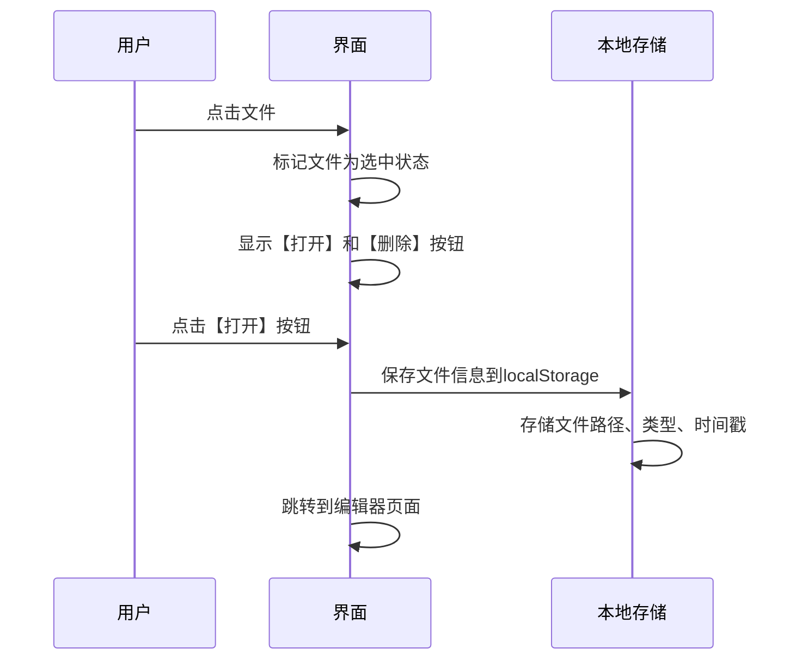
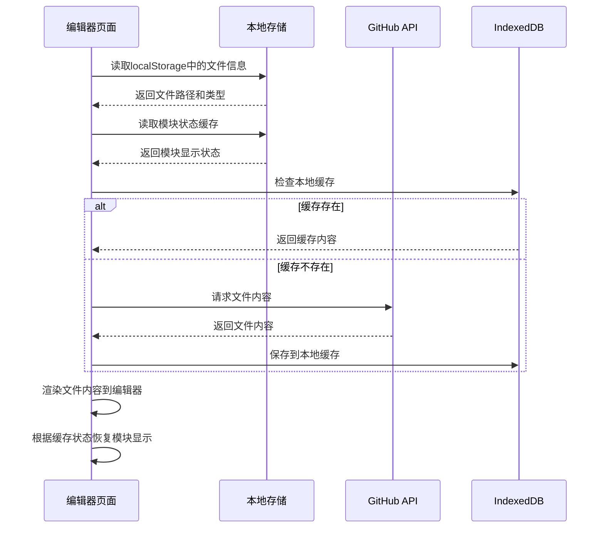
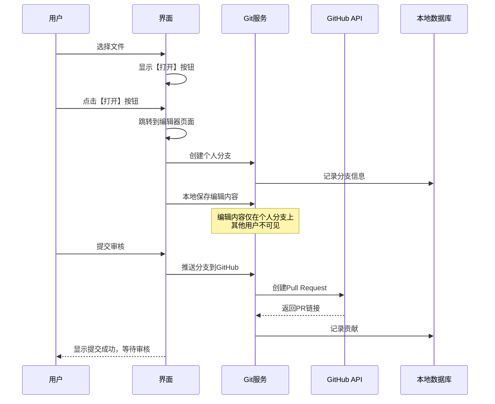
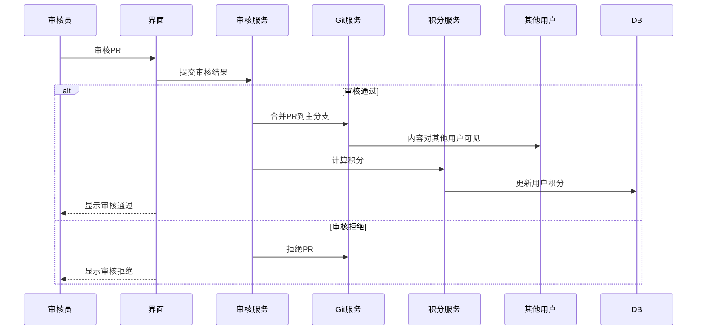

# SPCP 技术设计文档

## 📋 文档信息

- **项目名称**: SPCP - Serverless Project Contribution Platform
- **版本**: v1.0
- **创建日期**: 2025年1月21日
- **最后更新**: 2025年10月22日
- **文档类型**: 技术设计文档

## 🏗️ 系统架构设计

### 1.1 整体架构

```
┌─────────────────────────────────────────────────────────────────┐
│                    完全无服务器架构                              │
├─────────────────────────────────────────────────────────────────┤
│  客户端层 (多平台)                                               │
│  ┌─────────────┐ ┌─────────────┐ ┌─────────────┐ ┌─────────────┐ │
│  │  桌面应用   │ │  移动应用   │ │  网页应用   │ │  PWA应用    │ │
│  │  (Electron) │ │ (WebView)     │ │ (原生JS)   │ │ (Progressive)│ │
│  └─────────────┘ └─────────────┘ └─────────────┘ └─────────────┘ │
├─────────────────────────────────────────────────────────────────┤
│  业务逻辑层 (纯客户端)                                          │
│  ┌─────────────┐ ┌─────────────┐ ┌─────────────┐ ┌─────────────┐ │
│  │  Git操作    │ │  审核流程   │ │  积分系统   │ │  权限控制   │ │
│  └─────────────┘ └─────────────┘ └─────────────┘ └─────────────┘ │
├─────────────────────────────────────────────────────────────────┤
│  数据存储层 (GitHub仓库)                                        │
│  ┌─────────────┐ ┌─────────────┐ ┌─────────────┐ ┌─────────────┐ │
│  │ GitHub API  │ │  Git仓库    │ │  用户数据   │ │  项目文件   │ │
│  │ (认证+数据) │ │ (版本控制)  │ │ (明文存储)  │ │ (内容管理)  │ │
│  └─────────────┘ └─────────────┘ └─────────────┘ └─────────────┘ │
└─────────────────────────────────────────────────────────────────┘
```

### 1.2 核心组件

#### 1.2.1 桌面应用层
- **主进程**: Electron主进程，负责窗口管理和系统集成
- **渲染进程**: 单页应用(SPA)，完全JS动态生成用户界面
- **预加载脚本**: 安全的进程间通信桥梁
- **加载策略**: 所有JS资源在index.html中一次性加载

#### 1.2.2 业务逻辑层
- **路由系统**: 原生JavaScript路由，动态切换页面内容
- **页面管理器**: 动态生成和管理所有页面组件
- **Git操作**: 封装Git操作和GitHub API调用
- **审核流程**: 处理审核工作流和决策
- **积分系统**: 计算和管理用户积分
- **权限控制**: 用户认证和权限控制

#### 1.2.3 数据存储层
- **GitHub仓库**: 所有数据的版本控制和存储
- **GitHub API**: 远程仓库同步和协作
- **本地缓存**: 本地文件存储和缓存（localStorage + IndexedDB）
- **状态管理**: 全局状态管理，避免页面间数据不一致

## 🔧 技术栈选择

### 2.1 多平台技术栈

#### 2.1.1 桌面应用
- **框架**: Electron + 原生JavaScript SPA
- **版本**: ^28.0.0
- **原因**: 跨平台桌面应用开发，支持Windows、macOS、Linux
- **架构**: 单页应用，完全JS动态生成界面

#### 2.1.2 移动应用
- **框架**: WebView + 原生JavaScript SPA
- **版本**: 最新
- **原因**: 跨平台移动应用开发，支持iOS和Android，使用WebView承载JavaScript SPA
- **架构**: 单页应用，完全JS动态生成界面

#### 2.1.3 网页应用
- **框架**: 原生JavaScript SPA + PWA
- **版本**: 最新
- **原因**: 纯Web应用，支持PWA功能，可安装到桌面
- **架构**: 单页应用，完全JS动态生成界面

### 2.2 核心框架与库

#### 2.2.1 前端框架
- **语言**: 原生JavaScript (ES6+)
- **架构**: 单页应用(SPA)，完全JS动态生成
- **原因**: 简化调试，无框架依赖，直接操作DOM，避免加载时序问题
- **优势**: 
  - 避免HTML模板加载时的闪烁问题
  - 统一的主题和国际化状态管理
  - 更流畅的用户体验，无页面刷新
  - 更好的性能，减少重复资源加载

#### 2.2.2 UI组件库
- **组件**: 原生CSS + HTML动态生成
- **原因**: 完全自定义UI，无第三方依赖，支持主题切换和国际化
- **通用模态框**: 支持输入、确认、信息三种类型，完全可复用
- **特性**: 
  - 支持键盘操作（回车确认、ESC取消）
  - 支持点击遮罩关闭
  - 自动聚焦和事件绑定
  - 完全支持主题切换和国际化
  - 响应式设计，支持移动端

#### 2.2.3 状态管理
- **方案**: localStorage + IndexedDB + 全局状态管理
- **原因**: 本地状态管理，支持离线操作，避免页面间数据不一致

#### 2.2.4 路由系统
- **方案**: 原生JavaScript路由
- **原因**: 轻量级路由，支持动态页面切换，避免页面刷新

#### 2.2.5 编辑器
- **库**: Monaco Editor
- **版本**: ^0.44.0
- **原因**: VS Code同款编辑器，支持语法高亮和智能提示
- **状态管理**: 模块状态缓存系统，使用localStorage持久化用户界面偏好

### 2.3 数据与集成

#### 2.3.1 数据存储
- **方案**: GitHub仓库 + 本地缓存
- **本地缓存**: localStorage + IndexedDB
- **原因**: 所有数据存储在GitHub仓库中，本地仅作缓存

#### 2.3.2 Git集成
- **工具**: Git命令行 + GitHub API
- **原因**: 利用GitHub的分布式版本控制能力

#### 2.3.3 GitHub API
- **库**: 原生fetch API
- **原因**: 无第三方依赖，直接调用GitHub REST API

#### 2.3.4 运行时环境
- **桌面**: Electron (Node.js)
- **Web**: 现代浏览器
- **原因**: 跨平台兼容，支持最新JavaScript特性

### 2.4 开发工具

#### 2.4.1 开发服务器
- **工具**: Python HTTP Server
- **命令**: `python -m http.server 8000`
- **原因**: 简单静态文件服务器，无Node.js依赖

#### 2.4.2 代码编辑
- **编辑器**: 任意代码编辑器
- **推荐**: VSCode, Sublime Text, Vim
- **原因**: 原生JavaScript开发，无特殊要求

## 📁 项目结构

```
spcp/
├── src/
│   ├── main/                    # Electron主进程
│   │   ├── main.js             # 主进程入口
│   │   └── preload.js          # 预加载脚本
│   └── renderer/               # 渲染进程 (SPA)
│       ├── index.html          # 单页应用入口，加载所有JS资源
│       ├── js/                 # JavaScript文件
│       │   ├── app.js          # 应用主入口，路由和状态管理
│       │   ├── router.js       # 路由系统
│       │   ├── pages/          # 页面组件
│       │   │   ├── LoginPage.js        # 登录页面组件
│       │   │   ├── DashboardPage.js    # 仪表盘页面组件
│       │   │   ├── ProjectDetailPage.js # 项目详情页面组件
│       │   │   ├── EditorPage.js       # 编辑器页面组件
│       │   │   ├── ReviewsPage.js      # 审核页面组件
│       │   │   └── SettingsPage.js     # 设置页面组件
│       │   ├── components/     # 通用组件
│       │   │   ├── Component.js        # 组件基类
│       │   │   ├── ComponentLoader.js  # 组件加载器
│       │   │   ├── Modal.js            # 通用模态框组件
│       │   │   └── ...                 # 其他组件
│       │   └── services/       # 服务层
│       │       ├── github-service.js   # GitHub API服务
│       │       ├── storage-service.js  # 数据存储服务
│       │       ├── i18n-service.js     # 国际化服务
│       │       └── theme-manager.js   # 主题管理服务
│       ├── templates/          # 模板文件目录
│       │   ├── auto-approve-collaborators.yml  # GitHub Actions工作流模板
│       │   └── README.md       # 模板文件说明文档
│       ├── locales/            # 国际化文件
│       │   ├── zh-CN.json      # 中文翻译
│       │   └── en-US.json      # 英文翻译
│       └── styles/             # 样式文件
│           ├── main.css        # 主样式文件
│           └── modal.css       # 模态框样式文件
├── docs/                       # 文档目录
│   ├── prd.md                 # 产品需求文档
│   ├── technical-design.md    # 技术设计文档
│   └── ui-design/             # UI设计文档
├── README.md                   # 项目说明
└── start-dev.bat              # 开发启动脚本
```

## 🏗️ SPA架构实现

### 3.1 应用初始化流程

#### 3.1.1 资源加载策略
```javascript
// index.html 中一次性加载所有资源
<!DOCTYPE html>
<html>
<head>
    <title>SPCP</title>
    <link rel="stylesheet" href="styles/main.css">
    <link rel="stylesheet" href="styles/modal.css">
</head>
<body>
    <div id="app"></div>
    
    <!-- 一次性加载所有JS资源 -->
    <script src="js/services/global-services.js"></script>
    <script src="js/services/i18n-service.js"></script>
    <script src="js/services/storage-service.js"></script>
    <script src="js/services/github-service.js"></script>
    <script src="js/services/theme-manager.js"></script>
    
    <script src="js/components/Component.js"></script>
    <script src="js/components/ComponentLoader.js"></script>
    <script src="js/components/Modal.js"></script>
    <!-- ... 其他组件 ... -->
    
    <script src="js/pages/LoginPage.js"></script>
    <script src="js/pages/DashboardPage.js"></script>
    <script src="js/pages/ProjectDetailPage.js"></script>
    <script src="js/pages/EditorPage.js"></script>
    <script src="js/pages/ReviewsPage.js"></script>
    <script src="js/pages/SettingsPage.js"></script>
    
    <script src="js/router.js"></script>
    <script src="js/app.js"></script>
</body>
</html>
```

#### 3.1.2 应用启动流程
```javascript
// app.js - 应用主入口
class SPCPApp {
    constructor() {
        this.router = new Router();
        this.currentPage = null;
        this.state = {
            user: null,
            theme: 'light',
            language: 'zh-CN',
            currentProject: null
        };
    }

    async init() {
        // 1. 等待所有服务加载完成
        await this.waitForServices();
        
        // 2. 初始化主题和国际化
        await this.initThemeAndI18n();
        
        // 3. 检查用户认证状态
        await this.checkAuthStatus();
        
        // 4. 初始化路由
        this.router.init();
        
        // 5. 渲染初始页面
        await this.renderInitialPage();
    }

    async waitForServices() {
        // 确保所有服务都已加载
        while (!window.I18nService || !window.StorageService || !window.GitHubService) {
            await new Promise(resolve => setTimeout(resolve, 10));
        }
    }

    async initThemeAndI18n() {
        // 初始化主题管理器
        window.themeManager = new ThemeManager();
        
        // 初始化国际化服务
        await window.I18nService.init();
        
        // 应用主题和语言设置
        document.documentElement.setAttribute('data-theme', this.state.theme);
        document.documentElement.setAttribute('lang', this.state.language);
    }
}
```

### 3.2 路由系统设计

#### 3.2.1 路由管理器
```javascript
// router.js - 路由系统
class Router {
    constructor() {
        this.routes = {
            '/': 'DashboardPage',
            '/login': 'LoginPage',
            '/project/:id': 'ProjectDetailPage',
            '/editor': 'EditorPage',
            '/reviews': 'ReviewsPage',
            '/settings': 'SettingsPage'
        };
        this.currentRoute = null;
    }

    init() {
        // 监听浏览器前进后退
        window.addEventListener('popstate', () => {
            this.handleRouteChange();
        });
        
        // 监听链接点击
        document.addEventListener('click', (e) => {
            if (e.target.matches('[data-route]')) {
                e.preventDefault();
                this.navigateTo(e.target.dataset.route);
            }
        });
        
        // 处理初始路由
        this.handleRouteChange();
    }

    navigateTo(path) {
        history.pushState(null, '', path);
        this.handleRouteChange();
    }

    async handleRouteChange() {
        const path = window.location.pathname;
        const route = this.matchRoute(path);
        
        if (route && route !== this.currentRoute) {
            await this.renderPage(route, path);
            this.currentRoute = route;
        }
    }

    matchRoute(path) {
        for (const [pattern, pageClass] of Object.entries(this.routes)) {
            if (this.isMatch(pattern, path)) {
                return pageClass;
            }
        }
        return 'DashboardPage'; // 默认页面
    }

    async renderPage(pageClass, path) {
        // 销毁当前页面
        if (window.app.currentPage) {
            window.app.currentPage.destroy();
        }
        
        // 创建新页面
        const PageClass = window[pageClass];
        window.app.currentPage = new PageClass();
        
        // 渲染页面
        await window.app.currentPage.render(path);
    }
}
```

### 3.3 页面组件设计

#### 3.3.1 页面基类
```javascript
// pages/BasePage.js - 页面基类
class BasePage {
    constructor() {
        this.container = document.getElementById('app');
        this.state = {};
    }

    async render(path) {
        // 清空容器
        this.container.innerHTML = '';
        
        // 生成页面HTML
        const html = this.generateHTML();
        
        // 渲染到DOM
        this.container.innerHTML = html;
        
        // 绑定事件
        this.bindEvents();
        
        // 初始化页面
        await this.init();
        
        // 应用主题和国际化
        this.applyThemeAndI18n();
    }

    generateHTML() {
        // 子类实现具体的HTML生成逻辑
        throw new Error('generateHTML method must be implemented');
    }

    bindEvents() {
        // 子类实现具体的事件绑定逻辑
    }

    async init() {
        // 子类实现具体的初始化逻辑
    }

    applyThemeAndI18n() {
        // 应用主题
        if (window.themeManager) {
            window.themeManager.applyTheme();
        }
        
        // 应用国际化
        if (window.I18nService) {
            window.I18nService.translatePage();
        }
    }

    destroy() {
        // 清理事件监听器和定时器
        this.container.innerHTML = '';
    }
}
```

#### 3.3.2 通用模态框组件设计
```javascript
// components/Modal.js - 通用模态框组件
class Modal extends Component {
    constructor(props = {}) {
        super(props);
        this.state = {
            show: false,
            type: 'info', // 'info', 'input', 'confirm'
            title: '',
            message: '',
            inputValue: '',
            inputPlaceholder: '',
            callback: null
        };
    }

    showInfo(title, message) {
        this.setState({
            show: true,
            type: 'info',
            title: title,
            message: message,
            inputValue: '',
            inputPlaceholder: '',
            callback: null
        });
        this.rerender();
    }

    showInput(title, message, placeholder = '', defaultValue = '', callback = null) {
        this.setState({
            show: true,
            type: 'input',
            title: title,
            message: message,
            inputValue: defaultValue,
            inputPlaceholder: placeholder,
            callback: callback
        });
        this.rerender();
        // 自动聚焦到输入框
        setTimeout(() => {
            const input = this.element.querySelector('#modal-input');
            if (input) {
                input.focus();
            }
        }, 0);
    }

    showConfirm(title, message, callback = null) {
        this.setState({
            show: true,
            type: 'confirm',
            title: title,
            message: message,
            inputValue: '',
            inputPlaceholder: '',
            callback: callback
        });
        this.rerender();
    }

    hide() {
        this.setState({
            show: false,
            type: 'info',
            title: '',
            message: '',
            inputValue: '',
            inputPlaceholder: '',
            callback: null
        });
        this.rerender();
    }

    handleConfirm() {
        if (this.state.callback) {
            if (this.state.type === 'input') {
                this.state.callback(this.state.inputValue);
            } else if (this.state.type === 'confirm') {
                this.state.callback(true);
            }
        }
        this.hide();
    }

    handleCancel() {
        if (this.state.callback && this.state.type === 'confirm') {
            this.state.callback(false);
        }
        this.hide();
    }

    handleInputChange(event) {
        this.setState({ inputValue: event.target.value });
    }

    render() {
        if (!this.state.show) {
            return document.createElement('div');
        }

        const container = document.createElement('div');
        container.innerHTML = `
            <div class="modal-overlay" id="modal-overlay">
                <div class="modal-content">
                    <div class="modal-header">
                        <h3>${this.state.title}</h3>
                        <button class="btn-close" id="modal-close">×</button>
                    </div>
                    <div class="modal-body">
                        ${this.renderBody()}
                    </div>
                    <div class="modal-footer">
                        ${this.renderFooter()}
                    </div>
                </div>
            </div>
        `;
        return container.firstElementChild;
    }

    bindEvents() {
        if (!this.element) return;

        // 关闭按钮
        const closeBtn = this.element.querySelector('#modal-close');
        if (closeBtn) {
            closeBtn.addEventListener('click', this.handleCancel.bind(this));
        }

        // 取消按钮 (input/confirm)
        const cancelBtn = this.element.querySelector('#modal-cancel');
        if (cancelBtn) {
            cancelBtn.addEventListener('click', this.handleCancel.bind(this));
        }

        // 确认按钮 (input/confirm)
        const confirmBtn = this.element.querySelector('#modal-confirm');
        if (confirmBtn) {
            confirmBtn.addEventListener('click', this.handleConfirm.bind(this));
        }

        // 遮罩层点击关闭
        const overlay = this.element.querySelector('#modal-overlay');
        if (overlay) {
            overlay.addEventListener('click', (e) => {
                if (e.target === overlay) {
                    this.handleCancel();
                }
            });
        }

        // 输入框事件 (input)
        const input = this.element.querySelector('#modal-input');
        if (input) {
            input.addEventListener('input', this.handleInputChange.bind(this));
            input.addEventListener('keypress', (e) => {
                if (e.key === 'Enter') {
                    this.handleConfirm();
                }
            });
        }
    }

    destroy() {
        if (this.element && this.element.parentNode) {
            this.element.parentNode.removeChild(this.element);
        }
        this.element = null;
    }
}
```

#### 3.3.3 具体页面实现示例
```javascript
// pages/LoginPage.js - 登录页面
class LoginPage extends BasePage {
    generateHTML() {
        return `
            <div class="login-container">
                <header class="login-header">
                    <h1 data-i18n="login.title">登录</h1>
                    <p data-i18n="login.subtitle">Serverless Project Contribution Platform</p>
                </header>
                
                <form class="login-form" id="loginForm">
                    <div class="form-group">
                        <label data-i18n="login.language">语言</label>
                        <select id="language-selector" data-i18n="login.selectLanguage">
                            <option value="zh-CN">中文</option>
                            <option value="en-US">English</option>
                        </select>
                    </div>
                    
                    <div class="form-group">
                        <label data-i18n="login.username">GitHub用户名</label>
                        <input type="text" id="username" data-i18n-placeholder="login.usernamePlaceholder">
                    </div>
                    
                    <div class="form-group">
                        <label data-i18n="login.email">邮箱地址</label>
                        <input type="email" id="email" data-i18n-placeholder="login.emailPlaceholder">
                    </div>
                    
                    <div class="form-group">
                        <label data-i18n="login.repository">仓库地址</label>
                        <input type="url" id="repository" data-i18n-placeholder="login.repositoryPlaceholder">
                    </div>
                    
                    <button type="submit" id="login-btn" data-i18n="login.submit">登录并克隆仓库</button>
                </form>
                
                <div class="login-footer">
                    <p data-i18n="login.legalText">登录即表示您同意我们的服务条款和隐私政策</p>
                </div>
            </div>
        `;
    }

    bindEvents() {
        const form = document.getElementById('loginForm');
        const languageSelector = document.getElementById('language-selector');
        
        form.addEventListener('submit', (e) => {
            e.preventDefault();
            this.handleLogin();
        });
        
        languageSelector.addEventListener('change', (e) => {
            this.changeLanguage(e.target.value);
        });
    }

    async init() {
        // 初始化表单数据
        this.loadFormData();
        
        // 设置语言选择器
        const languageSelector = document.getElementById('language-selector');
        languageSelector.value = window.app.state.language;
    }

    async handleLogin() {
        // 登录逻辑
        const formData = this.getFormData();
        
        try {
            // 显示加载状态
            this.showLoading();
            
            // 验证用户
            await window.GitHubService.verifyUser(formData.username);
            
            // 克隆仓库
            await this.cloneRepository(formData.repository);
            
            // 保存配置
            window.StorageService.saveUserConfig(formData);
            
            // 跳转到仪表盘
            window.app.router.navigateTo('/');
            
        } catch (error) {
            this.showError(error.message);
        } finally {
            this.hideLoading();
        }
    }

    // 使用通用模态框的示例
    initModal() {
        if (!this.state.modal) {
            this.state.modal = new Modal();
            const modalElement = this.state.modal.render();
            document.body.appendChild(modalElement);
            this.state.modal.element = modalElement;
            this.state.modal.bindEvents();
        }
    }

    showConfirmDialog() {
        this.initModal();
        this.state.modal.showConfirm(
            '确认操作',
            '您确定要执行此操作吗？',
            (confirmed) => {
                if (confirmed) {
                    console.log('用户确认了操作');
                } else {
                    console.log('用户取消了操作');
                }
            }
        );
    }

    showInputDialog() {
        this.initModal();
        this.state.modal.showInput(
            '输入信息',
            '请输入您的姓名：',
            '请输入姓名',
            '默认值',
            (value) => {
                console.log('用户输入了：', value);
            }
        );
    }

    showInfoDialog() {
        this.initModal();
        this.state.modal.showInfo(
            '信息提示',
            '操作已成功完成！'
        );
    }
}
```

### 3.4 状态管理

#### 3.4.1 全局状态管理
```javascript
// app.js 中的状态管理
class SPCPApp {
    constructor() {
        this.state = {
            user: null,
            theme: 'light',
            language: 'zh-CN',
            currentProject: null,
            projects: [],
            isAuthenticated: false
        };
        
        this.listeners = new Map();
    }

    setState(newState) {
        const oldState = { ...this.state };
        this.state = { ...this.state, ...newState };
        
        // 通知所有监听器
        this.notifyListeners(oldState, this.state);
        
        // 持久化状态
        this.persistState();
    }

    subscribe(key, callback) {
        if (!this.listeners.has(key)) {
            this.listeners.set(key, []);
        }
        this.listeners.get(key).push(callback);
    }

    notifyListeners(oldState, newState) {
        for (const [key, callbacks] of this.listeners) {
            if (oldState[key] !== newState[key]) {
                callbacks.forEach(callback => callback(newState[key], oldState[key]));
            }
        }
    }

    persistState() {
        // 持久化关键状态到localStorage
        const persistentState = {
            theme: this.state.theme,
            language: this.state.language,
            user: this.state.user
        };
        
        localStorage.setItem('spcp-app-state', JSON.stringify(persistentState));
    }

    restoreState() {
        // 从localStorage恢复状态
        const savedState = localStorage.getItem('spcp-app-state');
        if (savedState) {
            const persistentState = JSON.parse(savedState);
            this.setState(persistentState);
        }
    }
}
```

## 🔐 安全设计

### 3.1 认证与授权

#### 3.1.1 GitHub Personal Access Token认证
- **方式**: 用户输入邮箱、用户名、仓库地址和Personal Access Token
- **流程**: 验证Token有效性，获取用户权限信息，检测仓库权限
- **优势**: 简单直接，无需复杂OAuth流程，支持细粒度权限控制

**权限级别配置**：

**推荐权限设置（全选）**：
- 建议用户勾选所有权限选项
- 包括：repo, admin:org, user:email, read:user, write:org, admin:public_key 等
- 简化用户操作，避免技术门槛

**设计理念**：
- 用户友好：直接告诉用户"全选"，避免复杂的技术选择
- 权限充足：确保用户拥有完整的功能权限
- 系统控制：通过角色系统限制功能，而不是依赖Token权限
- 零门槛：非技术用户也能轻松完成设置

#### 3.1.2 用户权限管理
- **角色**: owner（所有者）, collaborator（协作者）, visitor（访客）
- **权限检测**: 自动检测用户对目标仓库的权限级别
- **自动工作流**: 所有者登录时自动检查并创建GitHub Actions工作流
- **存储**: 明文存储在GitHub仓库中，完全透明

#### 3.1.3 智能协作申请流程
- **申请提交**: 访客填写申请理由，系统创建GitHub Issue并触发Actions
- **状态显示**: 显示"正在审核中"UI，包含进度条和实时状态更新
- **工作流轮询**: 每5秒轮询GitHub Actions工作流执行状态
- **自动接受邀请**: 工作流完成后自动接受协作者邀请
- **状态更新**: 申请完成后自动更新用户身份为协作者
- **UI更新**: 隐藏申请板块，显示成功消息
- **零等待体验**: 整个流程约15-30秒完成，用户无需手动操作

**技术实现细节**：
- **轮询机制**: `pollWorkflowStatus()` 方法每5秒检查工作流状态
- **邀请处理**: `acceptCollaboratorInvitation()` 自动接受协作者邀请
- **状态管理**: `updateUserToCollaborator()` 更新用户角色和权限
- **UI反馈**: 实时进度条和状态提示，提供流畅的用户体验

### 3.2 数据安全

#### 3.2.1 本地缓存安全
- **加密**: 本地缓存不加密，仅作临时存储
- **清理**: 支持手动清理缓存
- **隔离**: 不同用户数据隔离存储

### 3.3 权限控制

#### 3.3.1 基于角色的访问控制
- **visitor**: 只能查看公开内容
- **applicant**: 可以申请成为贡献者
- **contributor**: 可以编辑和提交内容
- **reviewer**: 可以审核提交的内容
- **admin**: 可以管理用户和项目

## 🔄 数据流设计

### 4.1 Git操作流程

#### 4.1.1 文件选择与编辑流程

##### 4.1.1.1 文件选择机制


##### 4.1.1.2 编辑器页面加载


#### 4.1.3 文件编辑流程


#### 4.1.4 审核流程


### 4.2 数据同步机制

#### 4.2.1 GitHub仓库同步策略
- **实时同步**: 通过GitHub API实时获取最新数据
- **本地缓存**: 使用IndexedDB缓存文件内容
- **冲突处理**: 基于Git的版本控制解决冲突

## 📊 性能优化

### 5.1 前端性能优化

#### 5.1.1 代码分割
- **策略**: 按页面分割JavaScript代码
- **加载**: 懒加载非关键页面
- **缓存**: 利用浏览器缓存机制

#### 5.1.2 虚拟滚动
- **场景**: 大文件列表显示
- **实现**: 只渲染可见区域的文件
- **优势**: 减少DOM节点，提升性能

### 5.2 客户端性能优化

#### 5.2.1 缓存优化
- **策略**: 多级缓存机制
- **存储**: localStorage + IndexedDB
- **更新**: 智能缓存失效策略

#### 5.2.2 GitHub API优化
- **限制**: 遵守GitHub API速率限制
- **缓存**: 缓存API响应结果
- **批处理**: 批量处理API请求

## 🧪 测试策略

### 6.1 测试分层

#### 6.1.1 单元测试
- **范围**: 服务层和工具函数
- **工具**: 原生JavaScript测试
- **覆盖率**: 关键业务逻辑100%覆盖

#### 6.1.2 集成测试
- **范围**: API集成和数据处理
- **工具**: 模拟GitHub API
- **验证**: 数据流完整性

#### 6.1.3 端到端测试
- **范围**: 完整用户流程
- **工具**: 浏览器自动化测试
- **场景**: 关键用户路径

## 🚀 部署方案

### 7.1 桌面应用打包

#### 7.1.1 桌面应用构建
- **工具**: Electron Builder
- **平台**: Windows, macOS, Linux
- **分发**: 自动构建和发布

#### 7.1.2 自动更新机制
- **策略**: 基于GitHub Releases的更新
- **检查**: 启动时检查更新
- **下载**: 后台下载和安装

### 7.2 持续集成

#### 7.2.1 GitHub Actions配置
- **触发**: 代码推送和标签发布
- **构建**: 自动构建多平台应用
- **发布**: 自动发布到GitHub Releases

## 🔧 模板文件系统设计

### 8.1 设计理念

SPCP采用模板文件系统来管理外部配置文件，避免在JavaScript代码中硬编码复杂内容，提高代码的可维护性和可读性。

**核心设计原则：**
- **分离关注点**: 将配置文件与业务逻辑完全分离
- **动态加载**: 通过HTTP请求动态加载模板内容
- **版本控制**: 模板文件纳入版本控制，便于协作维护
- **错误处理**: 提供完善的错误处理机制

### 8.2 文件结构

```
spcp/src/renderer/templates/
├── auto-approve-collaborators.yml  # GitHub Actions工作流模板
└── README.md                       # 模板文件说明文档
```

### 8.3 模板加载机制

```javascript
// LoginPage.js - 模板加载实现
async loadWorkflowTemplate() {
    try {
        // 从服务器加载工作流模板文件
        const response = await fetch('/templates/auto-approve-collaborators.yml');
        if (response.ok) {
            return await response.text();
        } else {
            throw new Error(`HTTP ${response.status}: ${response.statusText}`);
        }
    } catch (error) {
        console.error('无法加载工作流模板:', error);
        throw new Error('无法加载GitHub Actions工作流模板文件');
    }
}
```

### 8.4 模板文件类型

#### 8.4.1 GitHub Actions工作流模板

**文件**: `auto-approve-collaborators.yml`
**用途**: 自动批准协作申请的GitHub Actions工作流
**触发条件**: 带有`contribution-application`标签的Issue被创建

**主要功能**:
- 自动提取申请人用户名
- 添加用户为仓库协作者
- 添加批准标签并关闭Issue
- 发送欢迎评论
- 错误处理：添加失败时标记错误并通知管理员

#### 8.4.2 模板文件管理

**文件位置**: `spcp/src/renderer/templates/`
**访问方式**: 通过HTTP请求 `/templates/文件名`
**维护方式**: 
- 模板文件独立于JavaScript代码
- 支持版本控制和协作编辑
- 提供详细的README说明文档

### 8.5 技术优势

**避免语法错误**:
- 解决JavaScript中嵌入YAML等格式文件的语法问题
- 避免特殊字符（如`*`）在模板字符串中的转义问题

**提高可维护性**:
- 便于非开发人员维护配置文件
- 支持模板文件的独立测试和验证
- 提高代码可读性和可维护性

**支持扩展性**:
- 易于添加新的模板文件类型
- 支持模板文件的动态更新
- 便于实现模板文件的版本管理

## 📚 参考文献

- [Electron官方文档](https://www.electronjs.org/docs)
- [GitHub API文档](https://docs.github.com/en/rest)
- [Monaco Editor文档](https://microsoft.github.io/monaco-editor/)
- [IndexedDB API文档](https://developer.mozilla.org/en-US/docs/Web/API/IndexedDB_API)