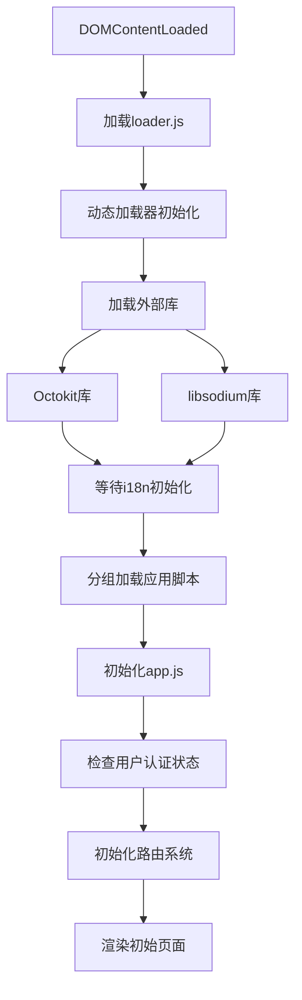
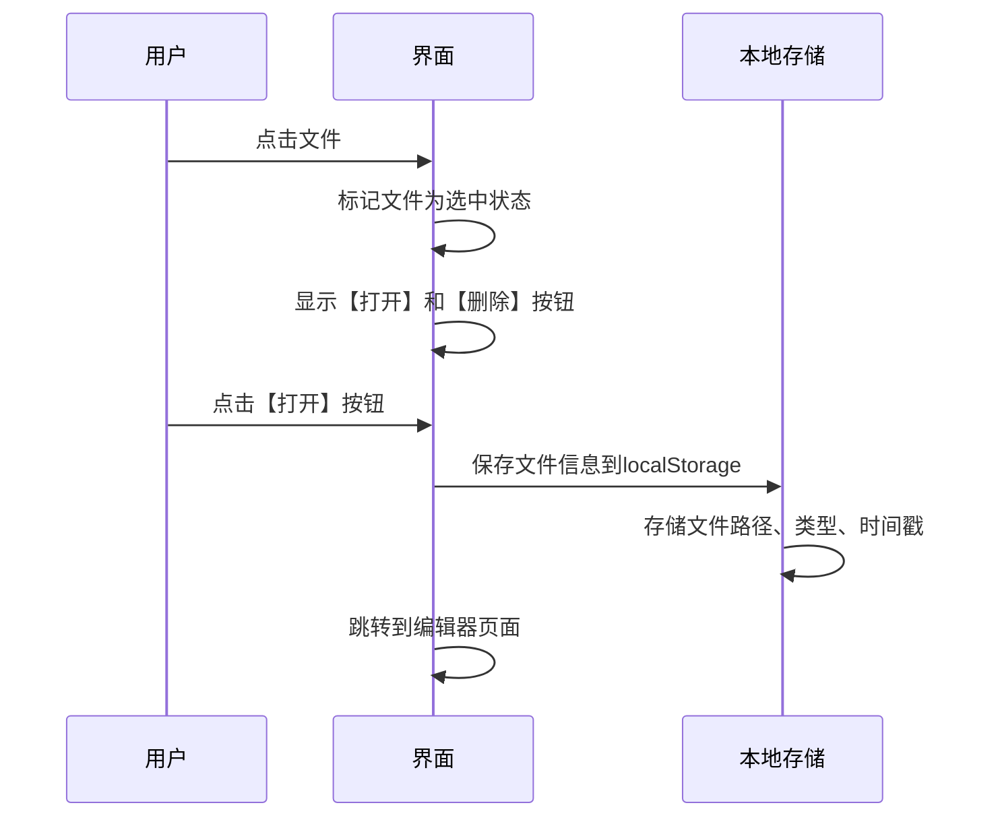
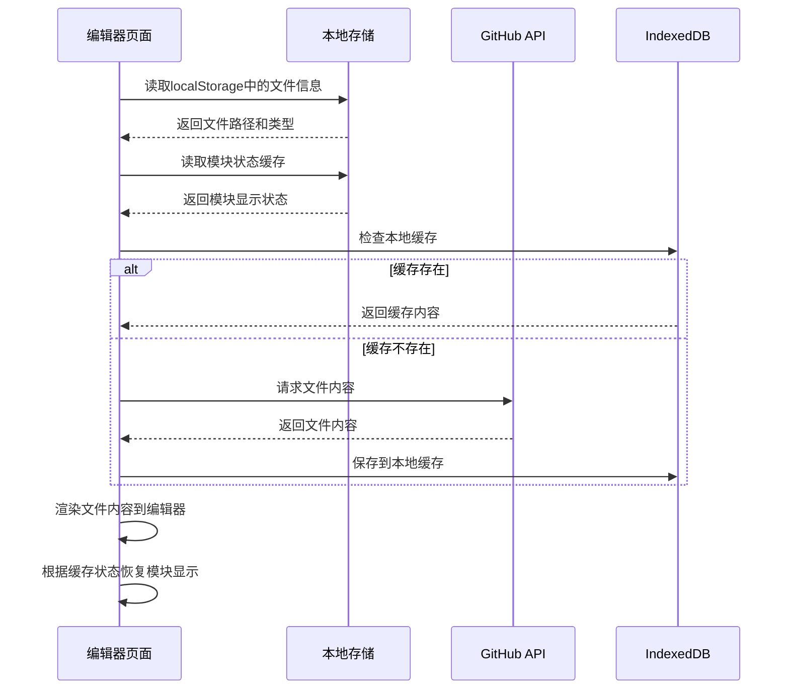
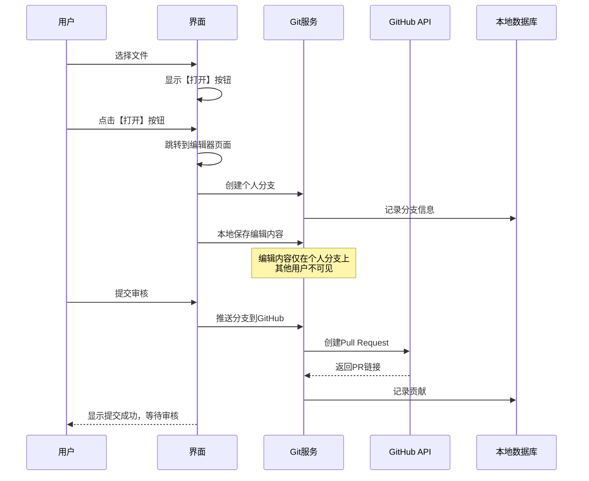
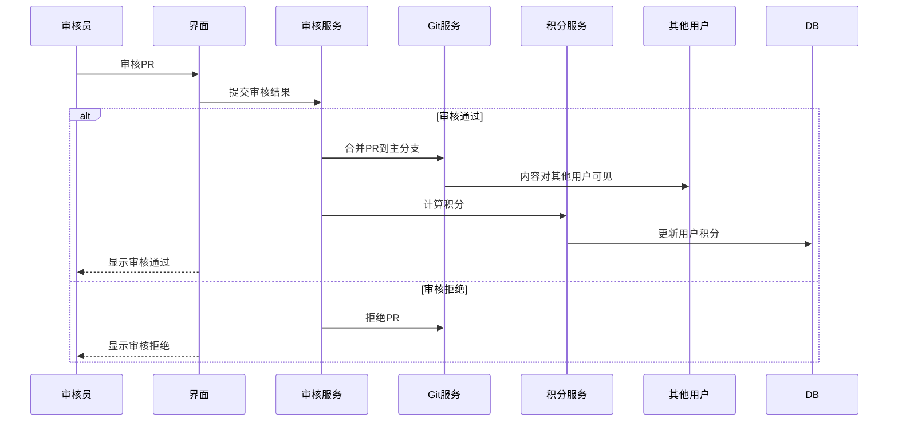
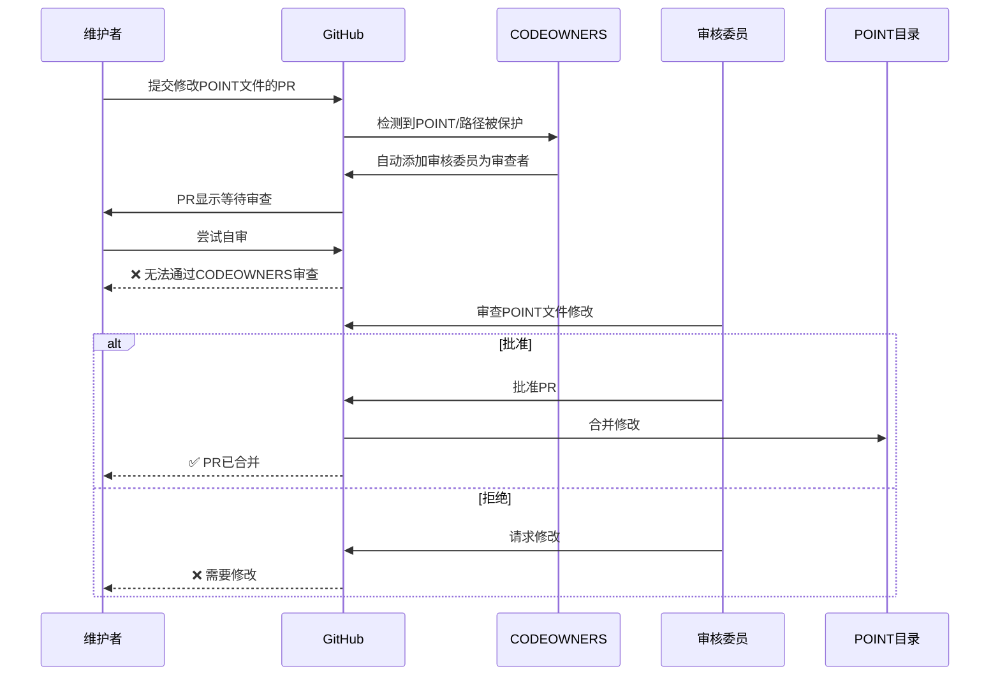
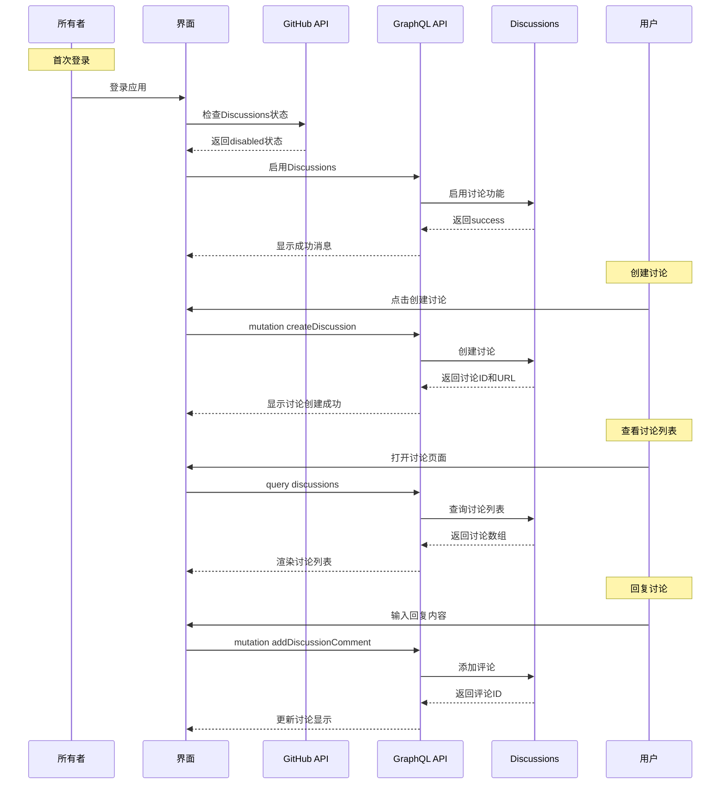
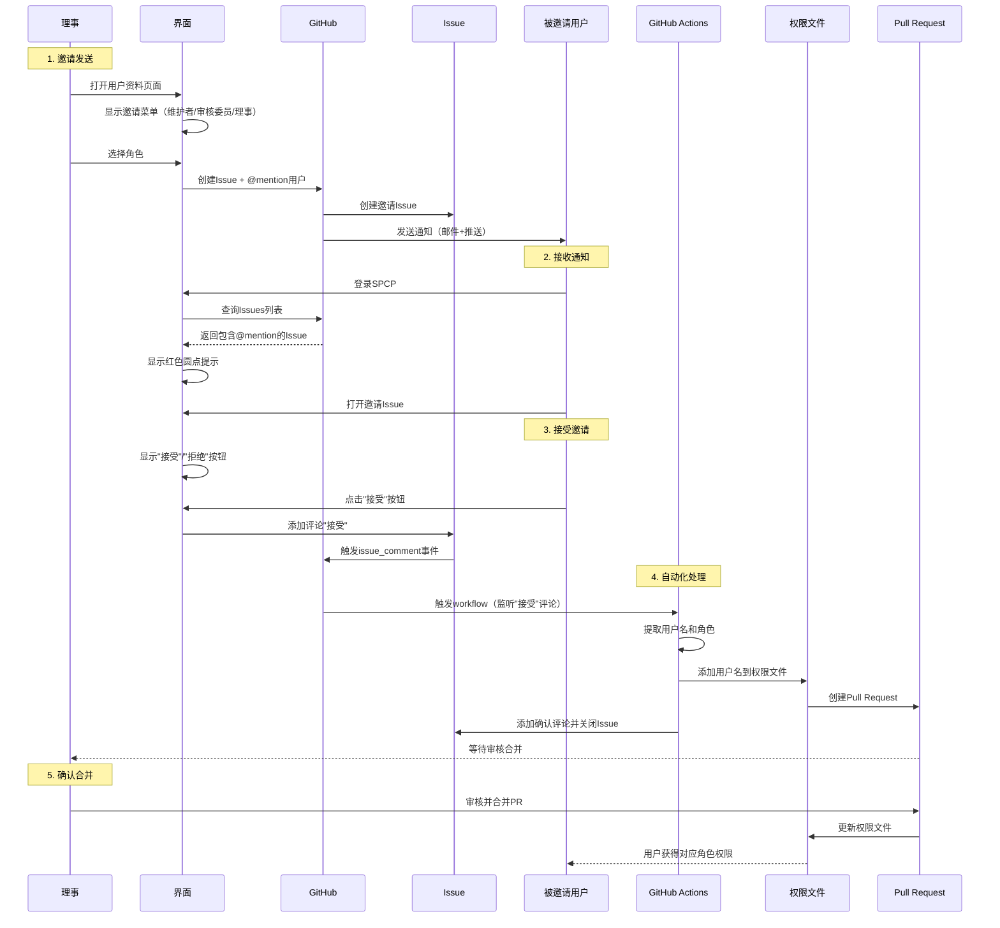

# SPCP 技术设计文档

## 📋 文档信息

- **项目名称**: SPCP - Serverless Project Contribution Platform
- **版本**: v1.1
- **创建日期**: 2025年10月21日
- **最后更新**: 2025年10月26日
- **文档类型**: 技术设计文档

## 🏗️ 系统架构设计

### 1.1 整体架构

```
┌─────────────────────────────────────────────────────────────────┐
│                    完全无服务器架构                              │
├─────────────────────────────────────────────────────────────────┤
│  客户端层 (多平台)                                               │
│  ┌─────────────┐ ┌─────────────┐ ┌─────────────┐ ┌─────────────┐ │
│  │  桌面应用   │ │  移动应用   │ │  网页应用   │ │  PWA应用    │ │
│  │  (Electron) │ │ (WebView)     │ │ (原生JS)   │ │ (Progressive)│ │
│  └─────────────┘ └─────────────┘ └─────────────┘ └─────────────┘ │
├─────────────────────────────────────────────────────────────────┤
│  业务逻辑层 (纯客户端)                                          │
│  ┌─────────────┐ ┌─────────────┐ ┌─────────────┐ ┌─────────────┐ │
│  │  Git操作    │ │  审核流程   │ │  积分系统   │ │  权限控制   │ │
│  └─────────────┘ └─────────────┘ └─────────────┘ └─────────────┘ │
│  ┌─────────────┐ ┌─────────────┐ ┌─────────────┐                │
│  │ Discussions│ │ Issues     │ │  搜索功能   │                │
│  └─────────────┘ └─────────────┘ └─────────────┘                │
│  ┌─────────────┐                                                │
│  │  用户管理   │                                                │
│  └─────────────┘                                                │
├─────────────────────────────────────────────────────────────────┤
│  数据存储层 (GitHub仓库)                                        │
│  ┌─────────────┐ ┌─────────────┐ ┌─────────────┐ ┌─────────────┐ │
│  │ GitHub API  │ │  Git仓库    │ │ Discussions│ │  项目文件   │ │
│  │ (认证+数据) │ │ (版本控制)  │ │  讨论数据   │ │ (内容管理)  │ │
│  └─────────────┘ └─────────────┘ └─────────────┘ └─────────────┘ │
│  ┌─────────────┐ ┌─────────────┐ ┌─────────────┐ ┌─────────────┐ │
│  │   Issues    │ │  用户数据   │ │ GitHub Pages│ │             │ │
│  │ 问题跟踪    │ │ (明文存储)  │ │ (静态部署)  │ │             │ │
│  └─────────────┘ └─────────────┘ └─────────────┘ └─────────────┘ │
└─────────────────────────────────────────────────────────────────┘
```

### 1.2 核心组件

#### 1.2.1 桌面应用层
- **主进程**: Electron主进程，负责窗口管理和系统集成
- **渲染进程**: 单页应用(SPA)，完全JS动态生成用户界面
- **预加载脚本**: 安全的进程间通信桥梁
- **加载策略**: 所有JS资源在index.html中一次性加载

#### 1.2.2 业务逻辑层
- **路由系统**: 原生JavaScript路由，动态切换页面内容
- **页面管理器**: 动态生成和管理所有页面组件
- **Git操作**: 封装Git操作和GitHub API调用
- **审核流程**: 处理审核工作流和决策
- **积分系统**: 计算和管理用户积分
- **权限控制**: 用户认证和权限控制

#### 1.2.3 数据存储层
- **GitHub仓库**: 所有数据的版本控制和存储
- **GitHub API**: 远程仓库同步和协作
- **本地缓存**: 本地文件存储和缓存（localStorage + IndexedDB）
- **状态管理**: 全局状态管理，避免页面间数据不一致

## 🔧 技术栈选择

### 2.1 多平台技术栈

#### 2.1.1 桌面应用
- **框架**: Electron + 原生JavaScript SPA
- **版本**: ^28.0.0
- **原因**: 跨平台桌面应用开发，支持Windows、macOS、Linux
- **架构**: 单页应用，完全JS动态生成界面

#### 2.1.2 移动应用
- **框架**: WebView + 原生JavaScript SPA
- **版本**: 最新
- **原因**: 跨平台移动应用开发，支持iOS和Android，使用WebView承载JavaScript SPA
- **架构**: 单页应用，完全JS动态生成界面

#### 2.1.3 网页应用
- **框架**: 原生JavaScript SPA + PWA
- **版本**: 最新
- **原因**: 纯Web应用，支持PWA功能，可安装到桌面
- **架构**: 单页应用，完全JS动态生成界面

### 2.2 核心框架与库

#### 2.2.1 前端框架
- **语言**: 原生JavaScript (ES6+)
- **架构**: 单页应用(SPA)，完全JS动态生成
- **原因**: 简化调试，无框架依赖，直接操作DOM，避免加载时序问题
- **优势**: 
  - 避免HTML模板加载时的闪烁问题
  - 统一的主题和国际化状态管理
  - 更流畅的用户体验，无页面刷新
  - 更好的性能，减少重复资源加载

#### 2.2.2 UI组件库
- **组件**: 原生CSS + HTML动态生成
- **原因**: 完全自定义UI，无第三方依赖，支持主题切换和国际化
- **通用模态框**: 支持输入、确认、信息三种类型，完全可复用
- **特性**: 
  - 支持键盘操作（回车确认、ESC取消）
  - 支持点击遮罩关闭
  - 自动聚焦和事件绑定
  - 完全支持主题切换和国际化
  - 响应式设计，支持移动端

#### 2.2.3 状态管理
- **方案**: localStorage + IndexedDB + 全局状态管理
- **原因**: 本地状态管理，支持离线操作，避免页面间数据不一致

#### 2.2.4 路由系统
- **方案**: 原生JavaScript路由
- **原因**: 轻量级路由，支持动态页面切换，避免页面刷新

#### 2.2.5 编辑器
- **库**: Monaco Editor
- **版本**: ^0.44.0
- **原因**: VS Code同款编辑器，支持语法高亮和智能提示
- **状态管理**: 模块状态缓存系统，使用localStorage持久化用户界面偏好

### 2.3 数据与集成

#### 2.3.1 数据存储
- **方案**: GitHub仓库 + 本地缓存
- **本地缓存**: localStorage + IndexedDB
- **原因**: 所有数据存储在GitHub仓库中，本地仅作缓存

#### 2.3.2 Git集成
- **工具**: Git命令行 + GitHub API
- **原因**: 利用GitHub的分布式版本控制能力

#### 2.3.3 GitHub API
- **库**: @octokit/rest.js (官方GitHub REST API客户端)
- **原因**: 使用官方库，避免重复造轮子，获得最新API支持和更好的错误处理

**重大技术变更 (2025年10月24日)**:
- **API集成策略**: 完全采用官方@octokit/rest.js库，移除所有自定义GitHub API封装
- **代码简化**: 直接使用Octokit方法调用GitHub API，避免重复造轮子
- **维护性提升**: 自动获得最新API支持，减少维护成本
- **类型安全**: 更好的TypeScript支持和错误处理
- **社区支持**: 官方维护，社区活跃，文档完善

#### 2.3.4 GitHub API类型说明

**GitHub API的两种类型**：

1. **REST API** (@octokit/rest.js)
   - **使用场景**: 仓库操作、文件管理、Issues、PR、用户信息等
   - **特点**: 基于HTTP方法，请求简单直接
   - **示例**: `octokit.rest.repos.get()`, `octokit.rest.issues.create()`

2. **GraphQL API** (@octokit/graphql)
   - **使用场景**: Discussions、复杂查询、自定义数据结构
   - **特点**: 灵活查询，一次请求获取所需数据
   - **示例**: `octokit.graphql()` - 使用GraphQL查询语言

**为什么Discussions必须使用GraphQL？**
- GitHub的Discussions功能是仓库级别的特性
- REST API不提供Discussions的直接操作端点
- 只能通过GraphQL API的`createDiscussion` mutation和讨论查询实现

#### 2.3.5 GitHub Discussions集成

**技术方案**：
- **主要API**: GraphQL API（使用@octokit/graphql）
- **辅助API**: REST API（用于获取仓库信息、权限检测）
- **自动启用机制**: 所有者首次登录时自动检测并启用Discussions功能

**实现细节**：
```javascript
// 混合使用REST和GraphQL API
const octokit = new Octokit({
    auth: token
});

// 1. 使用REST API检查Discussions状态
async checkDiscussionsStatus(owner, repo) {
    const response = await octokit.rest.repos.get({
        owner,
        repo
    });
    return response.data.hasDiscussionsEnabled;
}

// 2. 使用GraphQL API启用Discussions
async enableDiscussions(repositoryId) {
    const response = await octokit.graphql(`
        mutation EnableDiscussions($repoId: ID!) {
            updateRepository(input: {
                repositoryId: $repoId,
                hasDiscussionsEnabled: true
            }) {
                repository {
                    id
                    hasDiscussionsEnabled
                    name
                }
            }
        }
    `, {
        repoId: repositoryId
    });
    return response;
}

// 3. 使用GraphQL API创建讨论
async createDiscussion(repositoryId, categoryId, title, body) {
    const response = await octokit.graphql(`
        mutation CreateDiscussion(
            $repoId: ID!,
            $categoryId: ID!,
            $title: String!,
            $body: String!
        ) {
            createDiscussion(input: {
                repositoryId: $repoId,
                categoryId: $categoryId,
                title: $title,
                body: $body
            }) {
                discussion {
                    id
                    number
                    title
                    url
                    viewerSubscription
                }
            }
        }
    `, {
        repoId: repositoryId,
        categoryId: categoryId,
        title: title,
        body: body
    });
    return response;
}

// 4. 使用GraphQL API查询讨论列表
async getDiscussions(owner, repo, first = 10) {
    const response = await octokit.graphql(`
        query GetDiscussions($owner: String!, $repo: String!, $first: Int!) {
            repository(owner: $owner, name: $repo) {
                discussions(first: $first, orderBy: {field: CREATED_AT, direction: DESC}) {
                    nodes {
                        id
                        number
                        title
                        url
                        body
                        createdAt
                        author {
                            login
                            avatarUrl
                        }
                        category {
                            id
                            name
                            emoji
                        }
                    }
                }
            }
        }
    `, {
        owner: owner,
        repo: repo,
        first: first
    });
    return response;
}
```

**API选择原则**：
- **REST API**: 用于基础的仓库操作、文件管理、Issues、PR管理
- **GraphQL API**: 用于Discussions、复杂查询、需要自定义数据结构的场景
- **混合使用**: 根据功能特点选择最合适的API类型

#### 2.3.6 运行时环境
- **桌面**: Electron (Node.js)
- **Web**: 现代浏览器
- **原因**: 跨平台兼容，支持最新JavaScript特性

### 2.4 开发工具

#### 2.4.1 开发服务器
- **工具**: Python 编写的极简的HTTP Server
- **命令**: start-dev.bat
- **原因**: 完全无缓存处理，避免调试时缓存造成的麻烦

#### 2.4.2 代码编辑
- **编辑器**: 任意代码编辑器
- **推荐**: VSCode, Sublime Text, Vim
- **原因**: 原生JavaScript开发，无特殊要求

## 📁 项目结构

```
spcp/
├── src/
│   ├── main/                    # Electron主进程
│   │   ├── main.js             # 主进程入口
│   │   └── preload.js          # 预加载脚本
│   └── renderer/               # 渲染进程 (SPA)
│       ├── index.html          # 单页应用入口，加载所有JS资源
│       ├── js/                 # JavaScript文件
│       │   ├── app.js          # 应用主入口，路由和状态管理
│       │   ├── pages/          # 页面组件
│       │   │   ├── LoginPage.js        # 登录页面组件
│       │   │   ├── DashboardPage.js    # 仪表盘页面组件
│       │   │   ├── ProjectDetailPage.js # 项目详情页面组件
│       │   │   ├── EditorPage.js       # 编辑器页面组件
│       │   │   ├── ReviewsPage.js      # 审核页面组件
│       │   │   └── SettingsPage.js     # 设置页面组件
│       │   ├── components/     # 通用组件
│       │   │   ├── Component.js        # 组件基类
│       │   │   ├── ComponentLoader.js  # 组件加载器
│       │   │   ├── Modal.js            # 通用模态框组件
│       │   │   └── ...                 # 其他组件
│       │   └── services/       # 服务层
│       │       ├── storage-service.js  # 数据存储服务
│       │       ├── i18n-service.js     # 国际化服务
│       │       └── theme-service.js   # 主题管理服务
│       ├── templates/          # 模板文件目录
│       │   ├── auto-approve-collaborators.yml  # GitHub Actions工作流模板
│       │   └── README.md       # 模板文件说明文档
│       ├── locales/            # 国际化文件
│       │   ├── zh-CN.json      # 中文翻译
│       │   ├── ja-JP.json      # 日语翻译
│       │   └── en-US.json      # 英文翻译
│       └── styles/             # 样式文件
│           ├── main.css        # 主样式文件
│           └── modal.css       # 模态框样式文件
├── docs/                       # 文档目录
│   ├── prd.md                 # 产品需求文档
│   ├── technical-design.md    # 技术设计文档
│   └── ui-design/             # UI设计文档
├── README.md                   # 项目说明
└── start-dev.bat              # 开发启动脚本
```

## 🏗️ SPA架构实现

### 3.1 应用初始化流程

#### 3.1.1 资源加载策略

SPCP采用动态加载策略，在index.html中按需加载资源，避免阻塞页面渲染。

**核心原则**：
- **渐进式加载**: 先加载i18n服务，再加载其他依赖
- **分组并行**: 按依赖关系分组，组内并行加载
- **避免时序问题**: 通过动态加载器确保加载顺序
- **错误容错**: 加载失败时有友好的错误处理

**加载顺序**：
```javascript
// 1. index.html中只加载基础脚本
<script src="js/services/i18n-service.js"></script>
<script src="js/loader.js"></script>

// 2. loader.js完成以下加载流程：
// 2.1 加载外部库（Octokit、libsodium）
// 2.2 等待i18n服务初始化
// 2.3 按依赖关系分组加载应用脚本
// 2.4 初始化应用主入口

// 依赖关系分组：
// 第一组：基础服务（storage-service、theme-service）
// 第二组：基础组件类（Component、ComponentLoader）
// 第三组：基础UI组件（StatusIndicator、InfoItem等）
// 第四组：复合组件（Breadcrumb、MembersList等）
// 第五组：布局和表单组件
// 第六组：页面基类（BasePage）
// 第七组：页面组件（LoginPage、DashboardPage等）
// 第八组：应用主入口（app.js）
```

**技术实现**：
- 使用`<script>`标签动态创建脚本元素
- 使用`Promise.all()`实现组内并行加载
- 使用`waitForServices()`确保依赖就绪
- 使用localStorage缓存加载状态

#### 3.1.2 应用启动流程

应用启动遵循严格的初始化顺序，确保所有依赖正确加载。

**启动流程**：


**详细步骤**：
1. **DOM加载完成**: 监听`DOMContentLoaded`事件
2. **服务初始化**: 加载i18n服务和动态加载器
3. **外部库加载**: 加载Octokit和libsodium
4. **应用脚本加载**: 按依赖分组加载所有脚本
5. **应用初始化**: 
   - 等待所有服务就绪
   - 初始化语言设置
   - 检查用户认证状态
   - 初始化路由系统
   - 渲染初始页面
6. **路由处理**: 根据认证状态决定显示哪个页面

### 3.2 路由系统设计

#### 3.2.1 路由管理器

SPCP采用原生JavaScript实现客户端路由，支持路径匹配、查询参数解析和自动重定向。

**核心功能**：
- **路由注册**: 定义路径与页面类的映射关系
- **路径匹配**: 支持精确匹配和参数匹配
- **查询参数解析**: 自动解析URL查询参数
- **认证重定向**: 根据认证状态自动重定向
- **历史记录**: 支持浏览器前进/后退

**路由定义**：
```javascript
// 在app.js中定义路由
this.routes.set('/', 'DashboardPage');
this.routes.set('/login', 'LoginPage');
this.routes.set('/project-detail', 'ProjectDetailPage');
this.routes.set('/editor', 'EditorPage');
this.routes.set('/reviews', 'ReviewsPage');
this.routes.set('/settings', 'SettingsPage');
```

**认证重定向逻辑**：
```javascript
// 根据用户角色和权限自动重定向
if (userRole === 'owner' && currentRoute === 'LoginPage') {
    navigateTo('/project-detail'); // 所有者跳转到项目详情
}
else if (userRole === 'collaborator' && currentRoute === 'LoginPage') {
    navigateTo('/project-detail'); // 协作者跳转到项目详情
}
else if (userRole === 'visitor' && currentRoute === 'LoginPage') {
    navigateTo('/'); // 访客跳转到仪表盘
}
```

**路径匹配**：
- 支持精确匹配：`/login` → `LoginPage`
- 支持查询参数：`/editor?file=test.md` → `EditorPage`
- 支持动态路由：`/user/:username`（预留）

**页面渲染流程**：
1. 匹配路由：根据当前URL匹配对应的页面类
2. 检查认证：根据用户权限决定是否重定向
3. 销毁旧页面：调用destroy()清理旧页面
4. 创建新页面：实例化页面类
5. 解析参数：提取查询参数并传递给页面
6. 渲染页面：调用render()方法
7. 挂载DOM：将页面挂载到容器

### 3.3 页面组件设计

#### 3.3.1 页面基类

所有页面组件继承自Component基类，提供生命周期管理和事件处理。

**Component基类功能**：
```javascript
class Component {
    constructor(props = {}) {
        this.props = props;              // 组件属性
        this.state = {};                 // 组件状态
        this.element = null;             // DOM元素引用
        this.eventListeners = new Map(); // 事件监听器映射
    }
    
    // 生命周期方法
    render() { }              // 子类必须实现
    mount(container) { }      // 挂载到DOM
    destroy() { }            // 销毁组件
    setState(newState) { }    // 更新状态
    
    // 事件管理
    addEventListener() { }    // 添加监听器
    removeEventListener() { } // 移除监听器
    componentDidMount() { }  // 挂载后调用
    componentDidUpdate() { } // 更新后调用
    componentWillUnmount() { } // 销毁前调用
}
```

**BasePage基类**：
所有页面组件继承自BasePage，提供页面级别的功能。

**核心特性**：
- **生命周期管理**: mount、destroy、rerender
- **状态管理**: 组件级状态管理
- **事件绑定**: 自动绑定和解绑事件
- **国际化支持**: 自动应用i18n翻译
- **主题支持**: 自动应用当前主题

**页面渲染模式**：
```javascript
class MyPage extends BasePage {
    async render() {
        // 1. 创建主容器
        const container = document.createElement('div');
        
        // 2. 动态生成内容
        container.innerHTML = `
            <h1>${t('myPage.title')}</h1>
            <button class="btn-primary">${t('button.submit')}</button>
        `;
        
        // 3. 绑定事件
        container.querySelector('.btn-primary').onclick = () => {
            this.handleSubmit();
        };
        
        // 4. 返回容器
        return container;
    }
}
```

#### 3.3.2 通用模态框组件设计

SPCP提供完全可复用的通用模态框组件，支持三种类型：输入、确认、信息。

**组件特性**：
- **三种类型**: `input`（输入）、`confirm`（确认）、`info`（信息）
- **键盘支持**: 回车确认、ESC取消
- **遮罩关闭**: 点击遮罩可关闭
- **自动聚焦**: 自动聚焦输入框或按钮
- **主题适配**: 完全支持主题切换
- **国际化**: 完全支持多语言

**使用方法**：
```javascript
// 输入类型
const result = await Modal.show({
    type: 'input',
    title: t('modal.createFolder.title'),
    message: t('modal.createFolder.message'),
    placeholder: t('modal.createFolder.placeholder'),
    value: '',
    onConfirm: async (inputValue) => {
        // 处理用户输入
        return true; // 返回true关闭模态框
    }
});

// 确认类型
const confirmed = await Modal.show({
    type: 'confirm',
    title: t('modal.deleteFile.title'),
    message: t('modal.deleteFile.message'),
    onConfirm: async () => {
        // 执行删除操作
        return true;
    }
});

// 信息类型
await Modal.show({
    type: 'info',
    title: t('modal.info.title'),
    message: t('modal.info.message')
});
```

**技术实现要点**：
- 使用Promise实现异步操作
- 自动管理事件监听器（keyboard、focus、click）
- 使用`data-*`属性标识模态框类型
- 支持国际化字符串注入
- 响应式设计，支持移动端

### 3.4 状态管理

#### 3.4.1 全局状态管理

SPCP采用发布-订阅模式实现全局状态管理，支持状态持久化和监听器通知。

**状态结构**：
```javascript
class SPCPApp {
    constructor() {
        this.state = {
            // 用户相关
            user: null,              // 用户信息
            isAuthenticated: false,  // 认证状态
            userRole: null,          // 用户角色
            permissionInfo: null,    // 权限信息
            
            // 项目相关
            currentProject: null,    // 当前项目
            projects: [],           // 项目列表
            
            // UI相关（由服务管理）
            // theme: 'light',      // 由ThemeService管理
            // language: 'zh-CN'    // 由I18nService管理
        };
        
        this.listeners = new Map(); // 监听器映射
    }
}
```

**核心方法**：
1. **setState(newState)**: 更新状态并通知监听器
2. **subscribe(key, callback)**: 订阅状态变化
3. **persistState()**: 持久化关键状态到localStorage
4. **restoreState()**: 从localStorage恢复状态

**持久化策略**：
- 关键状态自动持久化：`user`
- 非关键状态在内存中：`currentProject`、`projects`
- 主题和语言由独立服务管理

**使用示例**：
```javascript
// 更新状态
app.setState({ user: newUser, isAuthenticated: true });

// 订阅状态变化
app.subscribe('user', (newUser, oldUser) => {
    console.log('User changed:', oldUser, '->', newUser);
});

// 获取状态
const state = app.getState();
```

**状态管理优势**：
- **单一数据源**: 所有状态集中在app.js
- **持久化**: 关键状态自动保存到localStorage
- **响应式**: 状态变化自动通知相关组件
- **类型安全**: 通过严格的状态结构避免错误

## 🔐 安全设计

### 3.1 认证与授权

#### 3.1.1 GitHub Personal Access Token认证
- **方式**: 用户输入邮箱、用户名、仓库地址和Personal Access Token
- **流程**: 验证Token有效性，获取用户权限信息，检测仓库权限
- **优势**: 简单直接，无需复杂OAuth流程，支持细粒度权限控制

**权限级别配置**：

**推荐权限设置（全选）**：
- 建议用户勾选所有权限选项
- 简化用户操作，避免技术门槛

**设计理念**：
- 用户友好：直接告诉用户"全选"，避免复杂的技术选择
- 权限充足：确保用户拥有完整的功能权限
- 系统控制：通过角色系统限制功能，而不是依赖Token权限
- 零门槛：非技术用户也能轻松完成设置

#### 3.1.2 用户权限管理
- **角色**: owner（所有者）, maintainer（维护者）, reviewer（审核委员）, visitor（访客）
- **权限检测**: 自动检测用户对目标仓库的权限级别
- **自动工作流**: 所有者登录时自动检查并创建GitHub Actions工作流
- **存储**: 明文存储在GitHub仓库中，完全透明

#### 3.1.3 CODEOWNERS权限保护机制

**设计目的**：
- 保护敏感文件（POINT目录、角色定义文件）不被维护者随意修改
- 通过CODEOWNERS强制审查机制确保权限隔离

**实现方案**：

1. **CODEOWNERS文件创建**（所有者登录时自动创建）：
```plaintext
# .github/CODEOWNERS

# 保护 POINT 目录，只允许审核委员修改
POINT/ @organization/reviewers-team

# 保护角色定义文件，只允许所有者修改
.github/reviewers.txt @organization/directors-team
.github/maintainers.txt @organization/directors-team

# 保护 CODEOWNERS 本身，防止被恶意修改
.github/CODEOWNERS @organization/directors-team
```

2. **分支保护规则启用**：
- 在GitHub仓库设置中启用 CODEOWNERS 审查要求
- 配置路径：Repository Settings → Branches → Branch protection rules
- 规则：`Require review from CODEOWNERS`

3. **权限隔离效果**：
```javascript
场景: 维护者试图修改 POINT/user.txt
├── 创建 PR
├── GitHub 自动检测 POINT/ 目录被 CODEOWNERS 保护
├── 自动添加 CODEOWNERS 审查者（审核委员）
├── 维护者无法自审
└── 必须等待 CODEOWNERS 批准才能合并
```

4. **优势**：
- **原生支持**: GitHub 原生机制，无需额外开发
- **自动审查**: 自动触发，无需手动配置
- **权限隔离**: 维护者拥有 Write 权限，但受 CODEOWNERS 限制
- **可追溯**: 所有审查记录可追溯
- **零运维**: 配置一次，长期有效

#### 3.1.4 智能协作申请流程
- **申请提交**: 访客填写申请理由，系统创建GitHub Issue并触发Actions
- **状态显示**: 显示"正在审核中"UI，包含进度条和实时状态更新
- **工作流轮询**: 每5秒轮询GitHub Actions工作流执行状态
- **自动接受邀请**: 工作流完成后自动接受协作者邀请
- **状态更新**: 申请完成后自动更新用户身份为协作者
- **UI更新**: 隐藏申请板块，显示成功消息
- **零等待体验**: 整个流程约15-30秒完成，用户无需手动操作

**技术实现细节**：
- **轮询机制**: `pollWorkflowStatus()` 方法每5秒检查工作流状态
- **邀请处理**: `acceptCollaboratorInvitation()` 自动接受协作者邀请
- **状态管理**: `updateUserToCollaborator()` 更新用户角色和权限
- **UI反馈**: 实时进度条和状态提示，提供流畅的用户体验

#### 3.1.5 角色邀请系统

**设计目的**：
- 允许理事（Director/Admin）主动邀请其他用户成为维护者、审核委员或理事
- 通过GitHub Issues发送邀请通知
- 自动化处理邀请接受流程，写入权限文件

**核心流程**：

1. **邀请发送**（由理事执行）
   - 理事在用户资料页面点击邀请按钮
   - 选择角色（维护者/审核委员/理事）
   - 系统自动创建GitHub Issue并@mention目标用户
   - 添加`role-invitation`标签标识邀请Issue
   - 被邀请用户收到GitHub通知（邮件+推送）

2. **通知机制**（用户登录时）
   - 系统检测未读的@mention Issue
   - 在导航栏"Issues"按钮显示红色圆点
   - 在Issues列表中标记未读Issue
   - Issue卡片右上角显示红色圆点

3. **接受/拒绝邀请**（用户操作）
   - 用户打开邀请Issue
   - 系统自动显示"接受"和"拒绝"按钮
   - 点击"接受"后，在Issue中添加"接受"评论
   - 点击"拒绝"后，在Issue中添加"拒绝"评论

4. **自动化处理**（GitHub Actions）
   - 监听Issue评论事件，检测"接受"或"accept"关键词
   - 从Issue标题提取用户名和角色信息
   - 将用户名添加到对应的权限文件：
     - 维护者 → `.github/maintainers.txt`
     - 审核委员 → `.github/reviewers.txt`
     - 理事 → `.github/directors.txt`
   - 自动创建Pull Request
   - 添加确认评论并关闭Issue

5. **权限更新**（手动确认）
   - 等待理事会确认并合并Pull Request
   - 权限文件更新后生效
   - 用户获得相应角色权限

**技术特点**：
- **公开透明**: 所有邀请记录在GitHub Issue中可追溯
- **自动化**: 使用GitHub Actions自动处理接受流程
- **多通知**: 用户通过邮件、推送、网页通知收到邀请
- **权限隔离**: 只有理事可以发送邀请
- **智能隐藏**: 自动隐藏已拥有权限的邀请选项
- **Event触发**: 使用issue_comment事件触发GitHub Actions工作流

**角色映射**：
- **维护者（Maintainer）**: 推送到仓库、合并Pull Request权限
- **审核委员（Reviewer）**: 审核代码、参与决策权限
- **理事（Director）**: 完全管理权限、可以邀请其他用户

### 3.2 数据安全

#### 3.2.1 本地缓存安全
- **加密**: 本地缓存不加密，仅作临时存储
- **清理**: 支持手动清理缓存
- **隔离**: 不同用户数据隔离存储

### 3.3 权限控制

#### 3.3.1 基于角色的访问控制
- **visitor**: 只能查看公开内容
- **applicant**: 可以申请成为贡献者
- **contributor**: 可以编辑和提交内容
- **reviewer**: 可以审核提交的内容
- **admin**: 可以管理用户和项目

## 🔄 数据流设计

### 4.1 Git操作流程

#### 4.1.1 文件选择与编辑流程

##### 4.1.1.1 文件选择机制


##### 4.1.1.2 编辑器页面加载


#### 4.1.3 文件编辑流程


#### 4.1.4 审核流程


#### 4.1.5 CODEOWNERS权限保护流程


#### 4.1.6 GitHub Discussions数据流


#### 4.1.7 角色邀请流程


### 4.2 数据同步机制

#### 4.2.1 GitHub仓库同步策略
- **实时同步**: 通过GitHub API实时获取最新数据
- **本地缓存**: 使用IndexedDB缓存文件内容
- **冲突处理**: 基于Git的版本控制解决冲突

## 📊 性能优化

### 5.1 前端性能优化

#### 5.1.1 代码分割
- **策略**: 按页面分割JavaScript代码
- **加载**: 懒加载非关键页面
- **缓存**: 利用浏览器缓存机制

#### 5.1.2 虚拟滚动
- **场景**: 大文件列表显示
- **实现**: 只渲染可见区域的文件
- **优势**: 减少DOM节点，提升性能

### 5.2 客户端性能优化

#### 5.2.1 缓存优化
- **策略**: 多级缓存机制
- **存储**: localStorage + IndexedDB
- **更新**: 智能缓存失效策略

#### 5.2.2 GitHub API优化
- **限制**: 遵守GitHub API速率限制
- **缓存**: 缓存API响应结果
- **批处理**: 批量处理API请求

## 🧪 测试策略

### 6.1 测试分层

#### 6.1.1 单元测试
- **范围**: 服务层和工具函数
- **工具**: 原生JavaScript测试
- **覆盖率**: 关键业务逻辑100%覆盖

#### 6.1.2 集成测试
- **范围**: API集成和数据处理
- **工具**: 模拟GitHub API
- **验证**: 数据流完整性

#### 6.1.3 端到端测试
- **范围**: 完整用户流程
- **工具**: 浏览器自动化测试
- **场景**: 关键用户路径

## 🚀 部署方案

### 7.1 桌面应用打包

#### 7.1.1 桌面应用构建
- **工具**: Electron Builder
- **平台**: Windows, macOS, Linux
- **分发**: 自动构建和发布

#### 7.1.2 自动更新机制
- **策略**: 基于GitHub Releases的更新
- **检查**: 启动时检查更新
- **下载**: 后台下载和安装

### 7.2 持续集成

#### 7.2.1 GitHub Actions配置
- **触发**: 代码推送和标签发布
- **构建**: 自动构建多平台应用
- **发布**: 自动发布到GitHub Releases

## 🔧 模板文件系统设计

### 8.1 设计理念

SPCP采用模板文件系统来管理外部配置文件，避免在JavaScript代码中硬编码复杂内容，提高代码的可维护性和可读性。

**核心设计原则：**
- **分离关注点**: 将配置文件与业务逻辑完全分离
- **动态加载**: 通过HTTP请求动态加载模板内容
- **版本控制**: 模板文件纳入版本控制，便于协作维护
- **错误处理**: 提供完善的错误处理机制

### 8.2 文件结构

```
spcp/src/renderer/templates/
├── auto-approve-collaborators.yml  # GitHub Actions工作流模板
└── README.md                       # 模板文件说明文档
```

### 8.3 模板加载机制

```javascript
// LoginPage.js - 模板加载实现
async loadWorkflowTemplate() {
    try {
        // 从服务器加载工作流模板文件
        const response = await fetch('/templates/auto-approve-collaborators.yml');
        if (response.ok) {
            return await response.text();
        } else {
            throw new Error(`HTTP ${response.status}: ${response.statusText}`);
        }
    } catch (error) {
        console.error('无法加载工作流模板:', error);
        throw new Error('无法加载GitHub Actions工作流模板文件');
    }
}
```

### 8.4 模板文件类型

#### 8.4.1 GitHub Actions工作流模板

**文件**: `auto-approve-collaborators.yml`
**用途**: 自动批准协作申请的GitHub Actions工作流
**触发条件**: 带有`contribution-application`标签的Issue被创建

**主要功能**:
- 自动提取申请人用户名
- 添加用户为仓库协作者
- 添加批准标签并关闭Issue
- 发送欢迎评论
- 错误处理：添加失败时标记错误并通知管理员

#### 8.4.2 模板文件管理

**文件位置**: `spcp/src/renderer/templates/`
**访问方式**: 通过HTTP请求 `/templates/文件名`
**维护方式**: 
- 模板文件独立于JavaScript代码
- 支持版本控制和协作编辑
- 提供详细的README说明文档

### 8.5 技术优势

**避免语法错误**:
- 解决JavaScript中嵌入YAML等格式文件的语法问题
- 避免特殊字符（如`*`）在模板字符串中的转义问题

**提高可维护性**:
- 便于非开发人员维护配置文件
- 支持模板文件的独立测试和验证
- 提高代码可读性和可维护性

**支持扩展性**:
- 易于添加新的模板文件类型
- 支持模板文件的动态更新
- 便于实现模板文件的版本管理

## 📚 参考文献

- [Electron官方文档](https://www.electronjs.org/docs)
- [GitHub API文档](https://docs.github.com/en/rest)
- [Monaco Editor文档](https://microsoft.github.io/monaco-editor/)
- [IndexedDB API文档](https://developer.mozilla.org/en-US/docs/Web/API/IndexedDB_API)