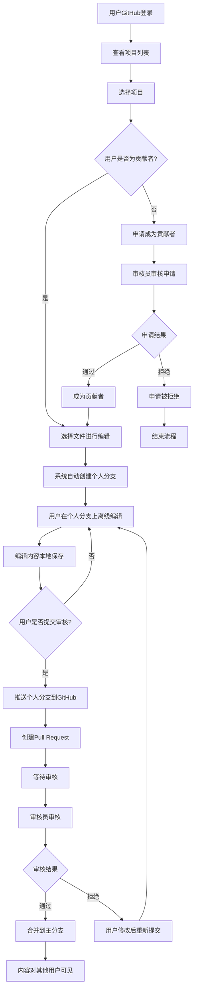
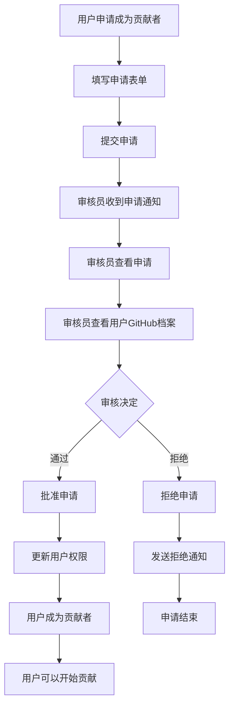
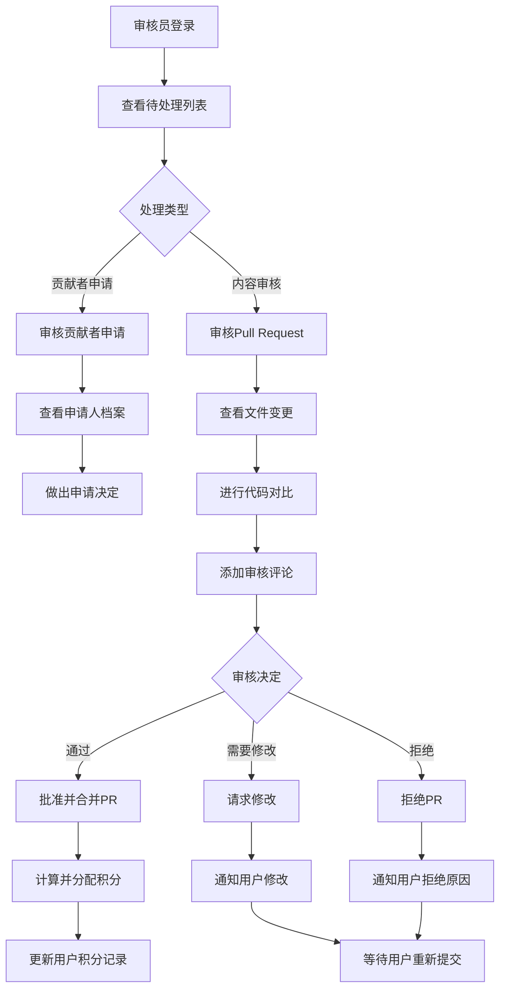
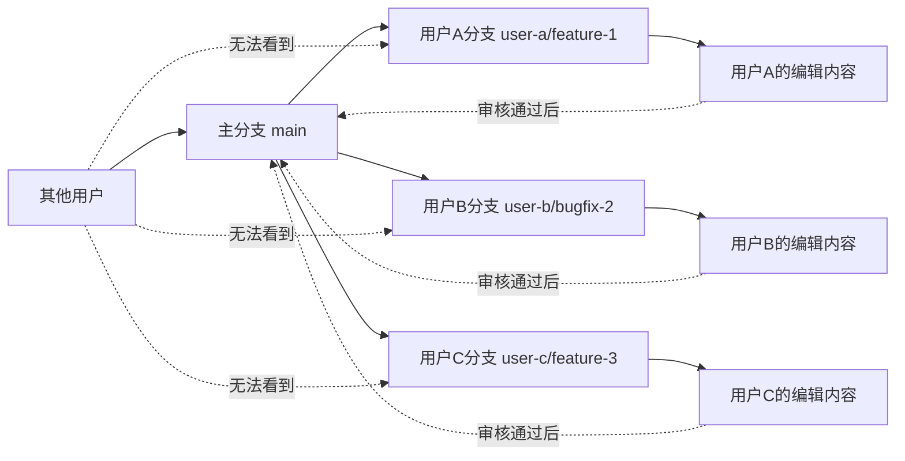

# SPCP 工作流程图

## 📋 文档信息

- **项目名称**: SPCP - 工作流程图
- **版本**: v1.0
- **创建日期**: 2025年10月21日
- **最后更新**: 2025年10月21日
- **文档类型**: 工作流程图

## 🔄 核心工作流程

### 1. 用户加入和编辑工作流



### 2. 用户申请成为贡献者流程



### 3. 审核员工作流



### 3. 数据隔离机制



## 🔒 数据隔离说明

### 3.1 分支隔离策略

#### 3.1.1 个人分支命名规则
```
格式: {github-username}/{type}/{description}
示例:
- john/feature/add-user-management
- jane/bugfix/fix-login-issue
- bob/edit/update-documentation
```

#### 3.1.2 分支生命周期
1. **创建**: 用户开始编辑时自动创建
2. **编辑**: 用户在分支上离线编辑，内容仅自己可见
3. **提交**: 用户提交PR后，审核员可见
4. **审核**: 审核员审核通过后合并到主分支
5. **清理**: 合并后自动删除个人分支

### 3.2 数据可见性

#### 3.2.1 编辑阶段
- **用户自己**: 可以看到个人分支上的所有编辑内容
- **其他用户**: 无法看到任何未审核的内容
- **审核员**: 无法看到编辑中的内容，只能看到提交的PR

#### 3.2.2 审核阶段
- **用户自己**: 可以看到PR状态和审核评论
- **审核员**: 可以看到PR内容和进行审核
- **其他用户**: 仍然无法看到未合并的内容

#### 3.2.3 合并后
- **所有用户**: 都可以看到合并到主分支的内容
- **历史记录**: 保留完整的编辑和审核历史

## 📊 状态管理

### 4.1 用户状态

```javascript
const UserStatus = {
  VISITOR: 'visitor',       // 访客，只能查看公开内容
  APPLICANT: 'applicant',   // 申请人，已申请成为贡献者
  CONTRIBUTOR: 'contributor', // 贡献者，可以编辑和提交内容
  REVIEWER: 'reviewer',     // 审核员，可以审核内容
  ADMIN: 'admin'            // 管理员，拥有所有权限
};
```

### 4.2 申请状态

```javascript
const ApplicationStatus = {
  PENDING: 'pending',       // 申请待审核
  APPROVED: 'approved',     // 申请通过
  REJECTED: 'rejected',     // 申请被拒绝
  WITHDRAWN: 'withdrawn'    // 用户撤回申请
};
```

### 4.3 编辑状态

```javascript
const EditStatus = {
  DRAFT: 'draft',           // 草稿状态，仅用户可见
  SUBMITTED: 'submitted',   // 已提交审核，等待审核
  UNDER_REVIEW: 'under_review', // 审核中
  APPROVED: 'approved',     // 审核通过，等待合并
  REJECTED: 'rejected',     // 审核拒绝，需要修改
  MERGED: 'merged',         // 已合并，对所有用户可见
  ABANDONED: 'abandoned'    // 用户放弃编辑
};
```

### 4.2 文件状态管理

```javascript
class FileStatusManager {
  constructor() {
    this.statuses = new Map();
  }
  
  // 获取文件编辑状态
  getFileStatus(filePath, userId) {
    const key = `${filePath}:${userId}`;
    return this.statuses.get(key) || EditStatus.DRAFT;
  }
  
  // 更新文件状态
  updateFileStatus(filePath, userId, status) {
    const key = `${filePath}:${userId}`;
    this.statuses.set(key, status);
  }
  
  // 获取用户正在编辑的文件列表
  getUserEditingFiles(userId) {
    const editingFiles = [];
    for (const [key, status] of this.statuses) {
      if (key.endsWith(`:${userId}`) && status === EditStatus.DRAFT) {
        const filePath = key.split(':')[0];
        editingFiles.push(filePath);
      }
    }
    return editingFiles;
  }
}
```

## 🔄 同步机制

### 5.1 本地同步

```javascript
class LocalSyncManager {
  constructor() {
    this.localChanges = new Map();
    this.syncQueue = [];
  }
  
  // 记录本地变更
  recordLocalChange(filePath, content, userId) {
    const key = `${filePath}:${userId}`;
    this.localChanges.set(key, {
      content,
      timestamp: Date.now(),
      synced: false
    });
  }
  
  // 同步到远程分支
  async syncToRemote(userId) {
    const userChanges = this.getUserChanges(userId);
    
    for (const [key, change] of userChanges) {
      if (!change.synced) {
        await this.pushToBranch(userId, key, change.content);
        change.synced = true;
      }
    }
  }
  
  // 从远程同步
  async syncFromRemote() {
    const remoteChanges = await this.fetchRemoteChanges();
    
    for (const change of remoteChanges) {
      if (this.isNewer(change)) {
        await this.applyRemoteChange(change);
      }
    }
  }
}
```

### 5.2 冲突处理

```javascript
class ConflictResolver {
  // 检测编辑冲突
  detectEditConflict(filePath, userId, remoteContent) {
    const localContent = this.getLocalContent(filePath, userId);
    
    if (localContent && localContent !== remoteContent) {
      return {
        hasConflict: true,
        localContent,
        remoteContent,
        conflictType: 'edit_conflict'
      };
    }
    
    return { hasConflict: false };
  }
  
  // 解决编辑冲突
  resolveEditConflict(filePath, userId, resolution) {
    switch (resolution.type) {
      case 'use_local':
        return this.useLocalVersion(filePath, userId);
      case 'use_remote':
        return this.useRemoteVersion(filePath, userId);
      case 'manual_merge':
        return this.manualMerge(filePath, userId, resolution.content);
    }
  }
}
```

## 📱 多平台同步

### 6.1 跨平台状态同步

```javascript
class CrossPlatformSync {
  constructor() {
    this.syncChannels = {
      desktop: new DesktopSyncChannel(),
      mobile: new MobileSyncChannel(),
      web: new WebSyncChannel()
    };
  }
  
  // 同步用户状态到所有平台
  async syncUserStatus(userId, status) {
    const promises = Object.values(this.syncChannels).map(
      channel => channel.syncStatus(userId, status)
    );
    
    await Promise.all(promises);
  }
  
  // 同步编辑内容
  async syncEditContent(userId, filePath, content) {
    const syncData = {
      userId,
      filePath,
      content,
      timestamp: Date.now()
    };
    
    for (const [platform, channel] of Object.entries(this.syncChannels)) {
      await channel.syncContent(syncData);
    }
  }
}
```

---

**文档状态**: 草稿  
**下次评审**: 2025年11月1日  
**负责人**: 技术团队  
**审核人**: 产品团队
